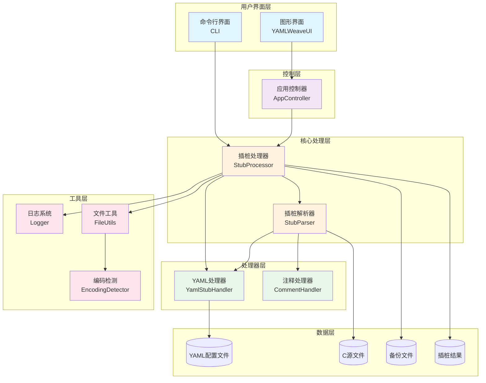
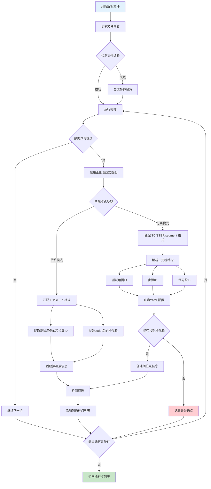
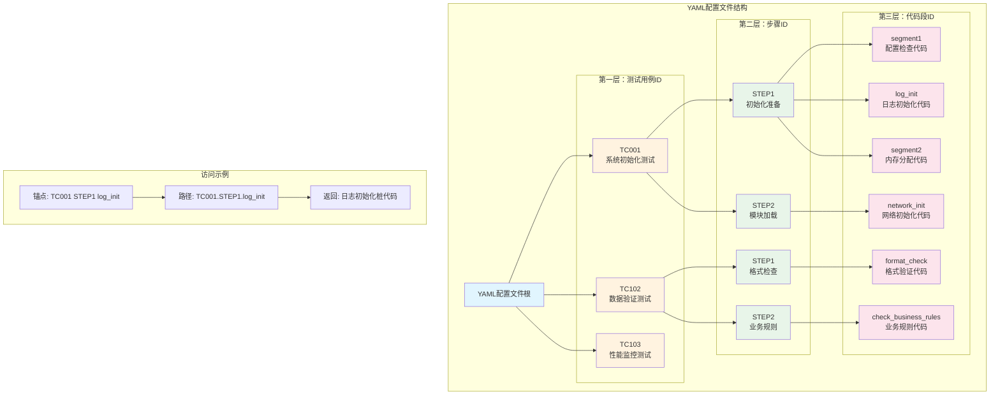
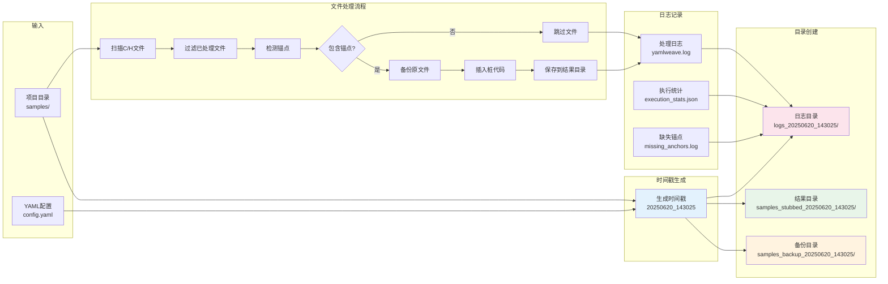
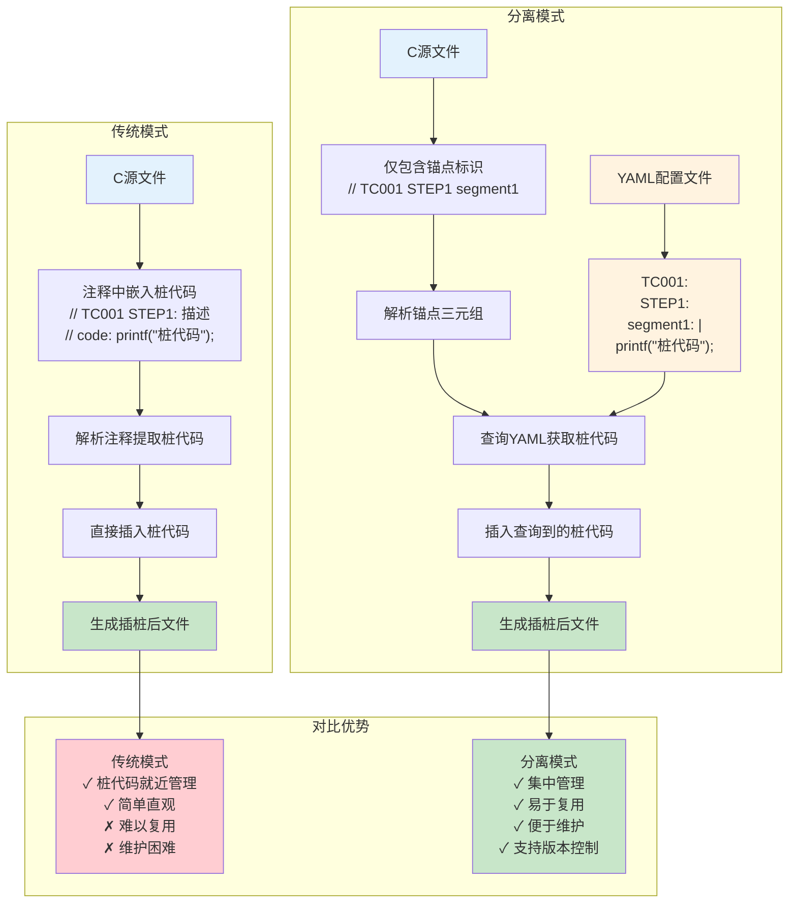
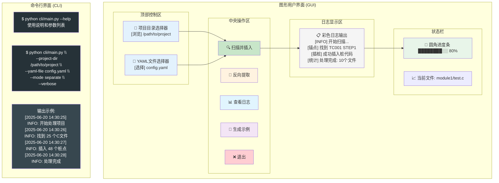
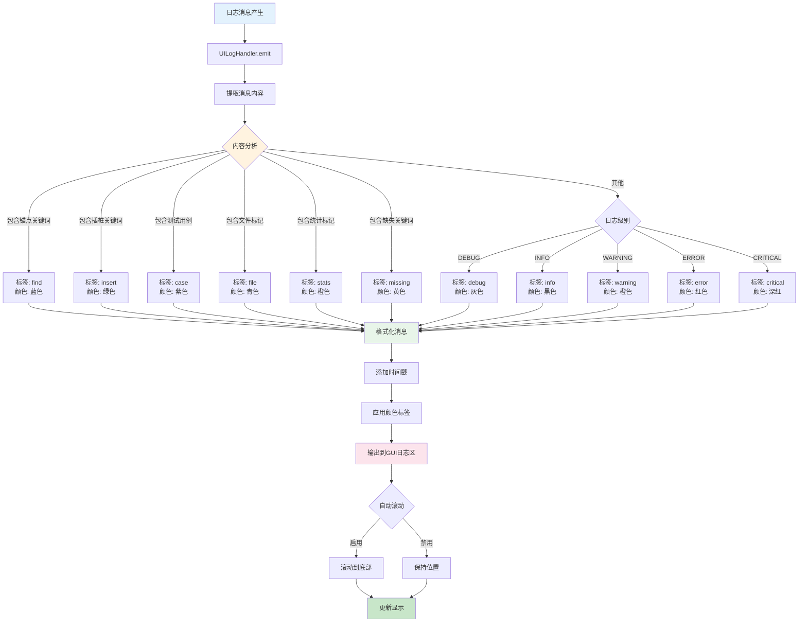
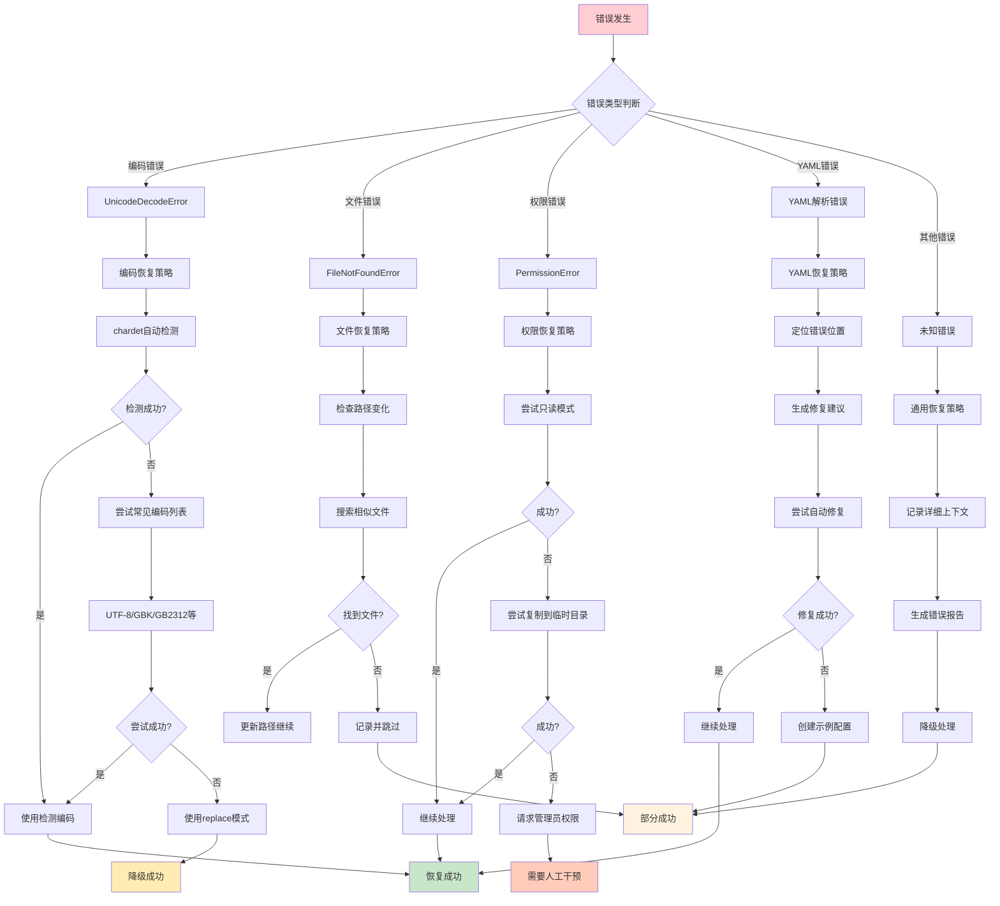
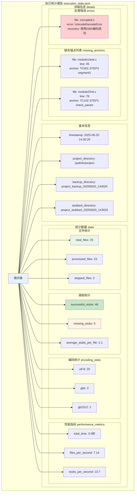

# 一种面向嵌入式软件的自动化插桩工具

## 技术领域

本发明涉及嵌入式软件测试与调试技术领域，特别涉及一种基于静态分析和配置文件管理的C语言项目自动插桩方法及其实现工具，能够在源代码的指定位置自动插入测试桩代码，实现测试用例的集中管理和跨文件复用。

## 背景技术

### 现有技术方案

嵌入式软件测试领域存在多种插桩技术方案，各有其特定的实施方式和适用场景。以下详细分析与本申请最为接近的现有技术方案：

#### 1. 传统手动插桩技术

**实施方式**：
传统手动插桩技术是嵌入式软件测试中最常用的方法，该技术采用人工编辑源代码的方式实现测试桩的插入。具体实施流程包括需求分析、位置确定、代码编写、编译验证和文档维护等多个阶段，形成了一套相对完整但效率低下的测试流程。

1. **需求分析与计划制定**：测试工程师首先分析被测软件的功能模块和关键路径，识别需要监控的函数入口、出口、分支判断点和异常处理点。这个过程需要深入理解业务逻辑，通常需要2-3天时间来制定完整的插桩计划。在复杂的嵌入式系统中，如汽车电子控制单元（ECU），需要识别数百个关键监控点，包括传感器数据读取、控制算法计算、执行器驱动等关键环节。

2. **代码标记阶段**：测试人员根据插桩计划，在源代码的指定位置手动添加预处理器指令或条件编译宏。这个过程极其繁琐，需要在每个目标位置精确插入测试代码：
```c
#ifdef DEBUG_MODE
    printf("进入函数 calculate_checksum\n");
    printf("输入参数: data=%p, length=%d\n", data, length);
    printf("当前时间戳: %lu\n", get_system_timestamp());
    log_function_entry("calculate_checksum", __FILE__, __LINE__);
#endif

int calculate_checksum(uint8_t *data, uint16_t length) {
    uint16_t result = 0;
    
#ifdef DEBUG_MODE
    if (data == NULL) {
        printf("错误：输入数据指针为空\n");
        log_error("NULL pointer detected in calculate_checksum");
    }
    printf("开始校验和计算，数据长度: %d\n", length);
#endif
    
    // 原始业务逻辑实现
    for (int i = 0; i < length; i++) {
        result += data[i];
#ifdef DEBUG_MODE
        if (i % 10 == 0) {  // 每10个字节记录一次中间状态
            printf("处理进度: %d/%d, 当前校验和: 0x%04X\n", i, length, result);
        }
#endif
    }
    
#ifdef DEBUG_MODE
    printf("校验和计算完成: result=0x%04X\n", result);
    log_function_exit("calculate_checksum", result);
    validate_checksum_range(result);  // 结果范围验证
#endif
    return result;
}
```

3. **分层编译控制机制**：通过多级宏定义实现精细化的编译控制，允许在不同的测试阶段启用不同级别的调试信息。编译控制不仅包括简单的开关宏，还涉及复杂的条件编译逻辑：
```c
// 多级调试控制
#define DEBUG_LEVEL_NONE    0
#define DEBUG_LEVEL_ERROR   1
#define DEBUG_LEVEL_WARN    2
#define DEBUG_LEVEL_INFO    3
#define DEBUG_LEVEL_VERBOSE 4

#ifndef DEBUG_LEVEL
#define DEBUG_LEVEL DEBUG_LEVEL_NONE
#endif

#if DEBUG_LEVEL >= DEBUG_LEVEL_ERROR
    #define DEBUG_ERROR(msg) printf("[ERROR] " msg "\n")
#else
    #define DEBUG_ERROR(msg)
#endif

#if DEBUG_LEVEL >= DEBUG_LEVEL_INFO
    #define DEBUG_INFO(msg) printf("[INFO] " msg "\n")
#else
    #define DEBUG_INFO(msg)
#endif
```

4. **手动文档管理系统**：测试人员需要维护详细的插桩位置清单，包括文件名、行号、插桩类型、测试目的等信息。这种人工管理方式存在严重的同步问题，当源代码发生变化时，文档更新往往滞后，导致插桩位置失效或重复。典型的管理文档包含以下信息：
```
插桩清单 v1.2.3
================
文件: src/checksum.c
  - 行45: 函数入口日志 (calculate_checksum)
  - 行52: 参数验证 (data指针检查)
  - 行67: 循环进度监控 (每10次迭代)
  - 行73: 函数出口日志 (返回值记录)

文件: src/communication.c  
  - 行123: CAN总线发送监控
  - 行156: 接收缓冲区状态检查
  - 行189: 错误帧计数统计
```

5. **编译验证与调试**：每次修改后都需要进行完整的编译测试，确保插桩代码不会引入语法错误或逻辑错误。在资源受限的嵌入式环境中，还需要验证插桩代码不会超出内存限制或影响实时性要求。这个过程通常需要多次迭代，每次迭代包括编译、下载、测试、调试等步骤。

6. **版本管理与清理**：测试完成后，需要手动清理所有插桩代码，恢复到原始状态。这个过程同样容易出错，特别是在有多个并行测试任务的情况下。传统做法是维护多个代码版本分支，但这种方式增加了版本管理的复杂性。

**与本申请的技术差异**：
- 本申请采用智能锚点识别算法自动定位插桩位置，而传统方法需要手动确定每个插桩点
- 本申请使用YAML配置文件集中管理桩代码，传统方法将测试代码直接嵌入源文件
- 本申请提供时间戳备份机制，传统方法缺乏系统性的版本管理

**技术缺点推导**：
该方法的具体实施过程导致以下技术问题：
- **处理效率低**：每个插桩点需要手动编辑，在包含数千个函数的大型项目中，人工处理时间呈指数级增长
- **内存占用不均**：测试代码与业务代码混合编译，无法进行精确的内存管理，在资源受限的嵌入式环境中造成内存碎片
- **CPU资源浪费**：条件编译产生的分支预测失败增加CPU指令流水线停顿
- **缓存命中率下降**：混合代码破坏了原有的局部性原理，降低指令缓存效率

#### 2. 基于GCC gcov的代码覆盖率插桩技术

**实施方式**：
GCC gcov工具是GNU编译器集合中的代码覆盖率分析工具，它采用编译器内置的自动插桩机制，在编译阶段自动向目标代码中注入覆盖率统计代码。该技术实现了从源码编译到覆盖率报告生成的完整自动化流程，是静态插桩技术的典型代表。

1. **编译器集成的插桩引擎**：gcov的插桩机制深度集成在GCC编译器的中间代码生成阶段。当启用`-fprofile-arcs -ftest-coverage`编译选项时，编译器在进行语法分析和中间代码优化后，自动识别所有的基本块（Basic Block）和控制流图中的边（Edge），然后为每个需要监控的代码路径插入计数器更新指令。这个过程完全自动化，无需人工干预：
```c
// 原始代码示例 - 复杂的控制流
int process_sensor_data(int sensor_value, int threshold) {
    int result = 0;
    
    if (sensor_value < 0) {
        // 分支1：传感器值异常
        log_error("Invalid sensor reading");
        result = ERROR_INVALID_SENSOR;
    } else if (sensor_value > threshold) {
        // 分支2：超过阈值
        result = activate_alarm(sensor_value);
        if (result == SUCCESS) {
            update_status(ALARM_ACTIVE);
        }
    } else {
        // 分支3：正常范围
        result = process_normal_value(sensor_value);
        for (int i = 0; i < sensor_value; i++) {
            if (i % 10 == 0) {
                checkpoint_progress(i);
            }
        }
    }
    
    return result;
}

// GCC gcov编译器插桩后的等效逻辑（简化表示）
int process_sensor_data(int sensor_value, int threshold) {
    __gcov_counter[0]++;  // 函数入口计数器
    int result = 0;
    
    __gcov_counter[1]++;  // 第一个判断点
    if (sensor_value < 0) {
        __gcov_counter[2]++;  // 分支1计数器
        log_error("Invalid sensor reading");
        result = ERROR_INVALID_SENSOR;
    } else {
        __gcov_counter[3]++;  // else分支计数器
        if (sensor_value > threshold) {
            __gcov_counter[4]++;  // 分支2计数器
            result = activate_alarm(sensor_value);
            __gcov_counter[5]++;  // 嵌套if入口
            if (result == SUCCESS) {
                __gcov_counter[6]++;  // 嵌套if true分支
                update_status(ALARM_ACTIVE);
            }
        } else {
            __gcov_counter[7]++;  // 分支3计数器
            result = process_normal_value(sensor_value);
            __gcov_counter[8]++;  // 循环入口
            for (int i = 0; i < sensor_value; i++) {
                __gcov_counter[9]++;  // 循环体计数器
                if (i % 10 == 0) {
                    __gcov_counter[10]++;  // 循环内条件分支
                    checkpoint_progress(i);
                }
            }
        }
    }
    
    __gcov_counter[11]++;  // 函数出口计数器
    return result;
}
```

2. **数据结构与存储机制**：gcov使用复杂的数据结构来存储覆盖率信息。编译时生成的`.gcno`文件包含程序的控制流图信息、基本块映射关系和计数器位置索引。运行时生成的`.gcda`文件则包含实际的执行计数数据。这些文件采用二进制格式存储，包含以下关键信息：
   - 源文件路径和时间戳信息
   - 函数列表和对应的基本块划分
   - 控制流图的边信息和计数器分配
   - 执行时的实际计数值

3. **运行时数据收集系统**：程序运行时，插入的计数器代码会自动递增对应的计数变量。gcov运行时库负责管理这些计数器的内存分配和数据同步。在程序正常退出时，运行时库会自动调用`__gcov_flush()`函数，将内存中的计数数据写入到`.gcda`文件中。这个过程包括文件锁定、数据序列化、原子写入等操作，确保数据的完整性和一致性。

4. **多线程与并发处理**：在多线程嵌入式应用中，gcov提供了线程安全的计数器更新机制。每个线程的计数器操作都是原子的，避免了竞争条件。同时，gcov支持多进程环境下的数据合并，当同一程序的多个实例同时运行时，各自产生的覆盖率数据可以自动合并生成综合报告。

5. **后处理分析与报告生成**：gcov工具链包含多个分析组件，用于处理覆盖率数据并生成可读报告。主要分析过程包括：
   - **数据解析**：读取`.gcno`和`.gcda`文件，重建程序的执行轨迹
   - **覆盖率计算**：基于计数数据计算行覆盖率、分支覆盖率和函数覆盖率
   - **报告生成**：生成文本、HTML或XML格式的覆盖率报告
   - **可视化输出**：支持与lcov等工具集成，生成图形化的覆盖率报告

6. **交叉编译与嵌入式适配**：gcov支持交叉编译环境，可以为ARM、MIPS等嵌入式处理器生成插桩代码。但在实际嵌入式部署中，需要解决文件系统访问、存储空间限制等问题。通常需要配置特殊的数据输出路径，或者通过网络传输将覆盖率数据发送到主机进行分析。

**与本申请的技术差异**：
- gcov专注于代码覆盖率统计，本申请专注于功能性测试桩代码的插入
- gcov的插桩逻辑固定（仅计数器），本申请支持任意复杂的测试桩代码
- gcov无法支持测试用例的分类管理，本申请提供三级索引的测试用例组织结构

**技术缺点推导**：
- **功能局限性**：gcov只能统计执行次数，无法插入复杂的调试信息、状态检查或性能监控代码
- **存储开销大**：每个基本块都需要独立的计数器变量，在大型项目中产生大量的全局变量占用RAM资源
- **实时性影响**：计数器更新操作涉及内存写入，在高频执行的代码路径上产生额外的内存访问延迟
- **文件I/O瓶颈**：程序退出时需要一次性写入所有覆盖率数据，在嵌入式系统的有限存储设备上造成I/O阻塞

#### 3. 基于Intel Pin的动态二进制插桩技术

**实施方式**：
Intel Pin是一个先进的动态二进制插桩框架，它采用即时编译（JIT）技术在程序运行时动态修改二进制指令序列，实现对程序执行行为的实时监控和分析。Pin技术代表了动态插桩领域的最高技术水平，其核心思想是在不修改源代码的情况下，通过运行时二进制翻译技术插入分析代码。

1. **动态二进制翻译引擎**：Pin的核心是一个复杂的JIT编译器，它在程序加载时拦截所有的二进制指令，并根据用户定义的插桩规则动态重写指令序列。这个过程包括指令解码、插桩点确定、代码生成和优化等多个阶段。Pin支持多种插桩粒度，从单个指令到基本块，再到整个函数，提供了极其灵活的插桩能力：
```cpp
// Pin工具的完整插桩示例 - 函数调用追踪
#include "pin.H"
#include <iostream>
#include <fstream>

// 全局变量用于存储分析结果
static std::ofstream TraceFile;
static UINT64 CallCount = 0;
static UINT64 InstructionCount = 0;

// 分析函数：记录函数调用信息
VOID RecordCall(ADDRINT ip, ADDRINT target, ADDRINT sp) {
    CallCount++;
    
    // 获取函数名称（如果符号信息可用）
    PIN_LockClient();
    string funcName = RTN_FindNameByAddress(target);
    if (funcName.empty()) {
        funcName = "Unknown";
    }
    PIN_UnlockClient();
    
    // 记录详细的调用信息
    TraceFile << std::hex << "Call #" << std::dec << CallCount 
              << ": From 0x" << std::hex << ip 
              << " to 0x" << target 
              << " (" << funcName << ")"
              << " SP=0x" << sp 
              << std::endl;
}

// 分析函数：记录指令执行
VOID RecordInstruction(ADDRINT ip) {
    InstructionCount++;
    if (InstructionCount % 1000000 == 0) {
        TraceFile << "Executed " << InstructionCount << " instructions" << std::endl;
    }
}

// 插桩回调函数：为每个指令添加分析代码
VOID InstrumentInstruction(INS ins, VOID *v) {
    // 为所有指令添加计数器
    INS_InsertCall(ins, IPOINT_BEFORE, (AFUNPTR)RecordInstruction,
                   IARG_INST_PTR, IARG_END);
    
    // 为函数调用指令添加特殊处理
    if (INS_IsCall(ins)) {
        INS_InsertPredicatedCall(ins, IPOINT_BEFORE,
                               (AFUNPTR)RecordCall,
                               IARG_INST_PTR,
                               IARG_BRANCH_TARGET_ADDR,
                               IARG_REG_VALUE, REG_STACK_PTR,
                               IARG_END);
    }
    
    // 为内存访问指令添加监控
    if (INS_IsMemoryRead(ins)) {
        INS_InsertPredicatedCall(ins, IPOINT_BEFORE,
                               (AFUNPTR)RecordMemoryRead,
                               IARG_INST_PTR,
                               IARG_MEMORYREAD_EA,
                               IARG_MEMORYREAD_SIZE,
                               IARG_END);
    }
}

// 程序退出时的清理函数
VOID Fini(INT32 code, VOID *v) {
    TraceFile << "=== Analysis Results ===" << std::endl;
    TraceFile << "Total Instructions: " << InstructionCount << std::endl;
    TraceFile << "Total Function Calls: " << CallCount << std::endl;
    TraceFile << "Average Instructions per Call: " 
              << (CallCount ? InstructionCount/CallCount : 0) << std::endl;
    TraceFile.close();
}
```

2. **多层次代码缓存系统**：Pin实现了一个复杂的代码缓存系统来优化性能。当一个基本块第一次执行时，Pin会将其翻译后的代码存储在代码缓存中。后续执行同一基本块时，直接从缓存中获取已翻译的代码，避免重复翻译开销。代码缓存系统包括多个层次：
   - **热代码缓存**：存储频繁执行的代码块，使用高速缓存行优化
   - **冷代码缓存**：存储偶尔执行的代码块，优化存储空间利用率
   - **跳转表缓存**：维护原始地址到翻译地址的映射关系
   - **元数据缓存**：存储插桩相关的分析数据和中间结果

3. **影子内存与元数据管理**：Pin使用影子内存技术来管理插桩过程中产生的元数据，确保分析代码不会干扰原程序的内存布局。影子内存系统包括以下组件：
   - **地址映射表**：维护原程序地址到影子内存地址的映射
   - **元数据存储**：为每个内存位置关联相应的分析元数据
   - **垃圾回收机制**：自动回收不再使用的影子内存空间
   - **内存保护**：确保原程序无法访问影子内存区域

4. **多线程与同步机制**：Pin提供了完整的多线程支持，能够处理复杂的并发程序。在多线程环境中，Pin为每个线程维护独立的执行上下文和分析状态，同时提供线程安全的数据收集机制：
```cpp
// 线程相关的插桩示例
PIN_LOCK lock;

VOID ThreadStart(THREADID threadid, CONTEXT *ctxt, INT32 flags, VOID *v) {
    PIN_GetLock(&lock, threadid + 1);
    TraceFile << "Thread " << threadid << " started" << std::endl;
    PIN_ReleaseLock(&lock);
}

VOID ThreadFini(THREADID threadid, const CONTEXT *ctxt, INT32 code, VOID *v) {
    PIN_GetLock(&lock, threadid + 1);
    TraceFile << "Thread " << threadid << " finished with code " << code << std::endl;
    PIN_ReleaseLock(&lock);
}
```

5. **指令级精确插桩**：Pin支持指令级的精确插桩，可以在任意指令的前后插入分析代码。这种精确的插桩能力使得Pin可以实现非常细粒度的程序分析，包括指令计数、内存访问模式分析、分支预测准确率统计等：
```cpp
// 详细的指令分析示例
VOID AnalyzeInstruction(ADDRINT ip, string *disasm, UINT32 opcode) {
    static UINT64 branchCount = 0;
    static UINT64 memoryAccess = 0;
    static UINT64 floatingPointOps = 0;
    
    // 分析指令类型
    if (opcode >= XED_ICLASS_JB && opcode <= XED_ICLASS_JZ) {
        branchCount++;
    }
    
    if (opcode >= XED_ICLASS_FADD && opcode <= XED_ICLASS_FXSAVE64) {
        floatingPointOps++;
    }
    
    // 定期输出统计信息
    if ((branchCount + memoryAccess + floatingPointOps) % 100000 == 0) {
        TraceFile << "IP: 0x" << std::hex << ip 
                  << " Inst: " << *disasm
                  << " Stats - Branch: " << std::dec << branchCount
                  << " Memory: " << memoryAccess
                  << " FP: " << floatingPointOps << std::endl;
    }
}
```

6. **可扩展的分析框架**：Pin提供了丰富的API和回调机制，支持开发复杂的程序分析工具。Pin工具可以实现多种分析功能，如性能分析、内存调试、安全漏洞检测、程序行为建模等。Pin还支持工具之间的协作，多个分析工具可以同时运行在同一个程序上，共享分析结果。

**与本申请的技术差异**：
- Pin需要特殊的运行时环境支持，本申请直接修改源代码，无运行时依赖
- Pin主要用于性能分析和漏洞检测，本申请专注于功能测试和调试
- Pin的插桩逻辑在运行时确定，本申请在编译前预定义所有插桩行为

**技术缺点推导**：
- **内存开销巨大**：Pin需要维护原程序的完整影子内存映射，内存消耗通常是原程序的2-5倍，超出嵌入式系统的内存限制
- **性能损失严重**：动态二进制翻译产生的额外开销使程序执行速度降低5-10倍，无法满足实时性要求严格的嵌入式应用
- **平台依赖性强**：Pin仅支持x86/x64架构，无法应用于ARM、MIPS等嵌入式处理器架构
- **调试复杂度高**：插桩后的程序在调试器中显示的是翻译后的指令序列，与源代码对应关系复杂，增加调试难度

#### 4. 基于LLVM Clang静态分析的插桩技术

**实施方式**：
LLVM Clang静态分析插桩技术是基于现代编译器技术的高级静态插桩方案，它利用Clang编译器强大的抽象语法树（AST）分析能力，在编译时期对源代码进行深度分析和自动化修改。该技术代表了静态分析与代码转换技术的先进水平，能够实现复杂的程序分析和自动化代码生成。

1. **深度AST分析与遍历机制**：Clang的AST分析系统提供了程序结构的完整抽象表示，包括语法结构、类型信息、作用域关系等。基于AST的插桩系统能够精确理解代码的语义结构，从而实现智能化的插桩决策。AST遍历采用访问者模式，支持多种遍历策略和定制化的分析逻辑：
```cpp
// 完整的AST分析插桩系统实现
#include "clang/Frontend/FrontendPluginRegistry.h"
#include "clang/AST/AST.h"
#include "clang/AST/ASTConsumer.h"
#include "clang/AST/RecursiveASTVisitor.h"
#include "clang/Frontend/CompilerInstance.h"
#include "clang/Rewrite/Core/Rewriter.h"

class AdvancedInstrumentationVisitor : public RecursiveASTVisitor<AdvancedInstrumentationVisitor> {
private:
    ASTContext *Context;
    Rewriter &TheRewriter;
    SourceManager &SM;
    std::map<std::string, int> FunctionCallCounts;
    std::set<std::string> InstrumentedFunctions;
    
public:
    AdvancedInstrumentationVisitor(ASTContext *Context, Rewriter &R) 
        : Context(Context), TheRewriter(R), SM(Context->getSourceManager()) {}
    
    // 遍历函数声明，进行函数级插桩
    bool VisitFunctionDecl(FunctionDecl *func) {
        if (!func->hasBody() || !SM.isInMainFile(func->getLocation())) {
            return true; // 跳过头文件中的函数和没有函数体的声明
        }
        
        std::string funcName = func->getNameAsString();
        if (InstrumentedFunctions.find(funcName) != InstrumentedFunctions.end()) {
            return true; // 避免重复插桩
        }
        
        // 分析函数复杂度，决定插桩策略
        CompoundStmt *body = dyn_cast<CompoundStmt>(func->getBody());
        if (body) {
            int complexity = analyzeFunctionComplexity(body);
            insertFunctionEntry(func, complexity);
            insertFunctionExit(func, complexity);
            InstrumentedFunctions.insert(funcName);
        }
        
        return true;
    }
    
    // 遍历函数调用表达式
    bool VisitCallExpr(CallExpr *call) {
        if (!SM.isInMainFile(call->getBeginLoc())) {
            return true;
        }
        
        FunctionDecl *callee = call->getDirectCallee();
        if (callee) {
            std::string calleeName = callee->getNameAsString();
            FunctionCallCounts[calleeName]++;
            
            // 为关键函数调用添加监控
            if (isSystemCriticalFunction(calleeName)) {
                insertCallMonitoring(call, calleeName);
            }
        }
        
        return true;
    }
    
    // 遍历循环语句，添加迭代监控
    bool VisitForStmt(ForStmt *forStmt) {
        if (!SM.isInMainFile(forStmt->getBeginLoc())) {
            return true;
        }
        
        // 分析循环边界和迭代次数
        Expr *condition = forStmt->getCond();
        if (condition && isComplexLoopCondition(condition)) {
            insertLoopMonitoring(forStmt);
        }
        
        return true;
    }
    
    // 遍历条件语句，添加分支覆盖
    bool VisitIfStmt(IfStmt *ifStmt) {
        if (!SM.isInMainFile(ifStmt->getBeginLoc())) {
            return true;
        }
        
        insertBranchMonitoring(ifStmt);
        return true;
    }
    
private:
    // 分析函数复杂度
    int analyzeFunctionComplexity(CompoundStmt *body) {
        int complexity = 1; // 基础复杂度
        for (auto stmt : body->body()) {
            if (isa<IfStmt>(stmt) || isa<ForStmt>(stmt) || 
                isa<WhileStmt>(stmt) || isa<SwitchStmt>(stmt)) {
                complexity++;
            }
        }
        return complexity;
    }
    
    // 判断是否为关键系统函数
    bool isSystemCriticalFunction(const std::string& funcName) {
        static std::set<std::string> criticalFuncs = {
            "malloc", "free", "pthread_create", "pthread_join",
            "send", "recv", "read", "write", "open", "close"
        };
        return criticalFuncs.find(funcName) != criticalFuncs.end();
    }
    
    // 插入函数入口监控代码
    void insertFunctionEntry(FunctionDecl *func, int complexity) {
        SourceLocation loc = func->getBody()->getBeginLoc().getLocWithOffset(1);
        std::ostringstream oss;
        oss << "\n    // Auto-generated instrumentation\n"
            << "    static unsigned long call_count_" << func->getNameAsString() << " = 0;\n"
            << "    call_count_" << func->getNameAsString() << "++;\n"
            << "    printf(\"[ENTER] " << func->getNameAsString() 
            << " (complexity: " << complexity << ", call #%lu)\\n\", "
            << "call_count_" << func->getNameAsString() << ");\n"
            << "    clock_t start_time = clock();\n";
        
        TheRewriter.InsertText(loc, oss.str());
    }
    
    // 插入函数出口监控代码
    void insertFunctionExit(FunctionDecl *func, int complexity) {
        // 需要处理多个返回点的情况
        FindReturnStmts visitor(TheRewriter, func->getNameAsString());
        visitor.TraverseStmt(func->getBody());
    }
};

// 用于查找和处理返回语句的辅助访问者
class FindReturnStmts : public RecursiveASTVisitor<FindReturnStmts> {
private:
    Rewriter &TheRewriter;
    std::string FuncName;
    
public:
    FindReturnStmts(Rewriter &R, const std::string& name) 
        : TheRewriter(R), FuncName(name) {}
    
    bool VisitReturnStmt(ReturnStmt *ret) {
        SourceLocation loc = ret->getBeginLoc();
        std::ostringstream oss;
        oss << "clock_t end_time = clock();\n"
            << "    printf(\"[EXIT] " << FuncName 
            << " (execution time: %lu ms)\\n\", "
            << "(end_time - start_time) * 1000 / CLOCKS_PER_SEC);\n    ";
        
        TheRewriter.InsertText(loc, oss.str());
        return true;
    }
};
```

2. **智能源码重写引擎**：Clang Rewriter提供了强大的源码修改能力，能够在保持代码结构和格式的前提下精确插入分析代码。重写引擎支持多种插入模式，包括位置插入、替换、删除等操作，并能自动处理编码格式、缩进风格和注释保持等细节问题：
```cpp
// 高级源码重写功能实现
class AdvancedRewriter {
private:
    Rewriter &BaseRewriter;
    ASTContext *Context;
    std::map<SourceLocation, std::string> PendingInsertions;
    
public:
    AdvancedRewriter(Rewriter &R, ASTContext *Ctx) 
        : BaseRewriter(R), Context(Ctx) {}
    
    // 智能插入代码，自动处理缩进和格式
    void smartInsertAfter(SourceLocation loc, const std::string& code) {
        SourceManager &SM = Context->getSourceManager();
        
        // 获取当前位置的缩进
        std::string indentation = getIndentationAt(loc);
        
        // 格式化插入的代码
        std::string formattedCode = formatCode(code, indentation);
        
        BaseRewriter.InsertTextAfter(loc, formattedCode);
    }
    
    // 批量应用所有重写操作
    void applyAllRewrites() {
        for (auto& insertion : PendingInsertions) {
            BaseRewriter.InsertText(insertion.first, insertion.second);
        }
        PendingInsertions.clear();
    }
    
private:
    std::string getIndentationAt(SourceLocation loc) {
        SourceManager &SM = Context->getSourceManager();
        
        // 获取行开始位置
        SourceLocation lineStart = SM.translateLineCol(
            SM.getMainFileID(), 
            SM.getSpellingLineNumber(loc), 
            1);
        
        // 计算缩进字符数
        const char* buffer = SM.getCharacterData(lineStart);
        std::string indentation;
        while (*buffer == ' ' || *buffer == '\t') {
            indentation += *buffer++;
        }
        
        return indentation;
    }
    
    std::string formatCode(const std::string& code, const std::string& indent) {
        std::istringstream iss(code);
        std::ostringstream oss;
        std::string line;
        
        while (std::getline(iss, line)) {
            if (!line.empty()) {
                oss << indent << line << "\n";
            } else {
                oss << "\n";
            }
        }
        
        return oss.str();
    }
};
```

3. **编译集成与工具链支持**：Clang插桩技术完全集成在标准编译流程中，可以作为编译器插件或独立工具运行。支持CMake、Make、Ninja等主流构建系统，能够无缝集成到现有的开发工作流中。编译集成还包括错误处理、诊断信息生成、增量编译支持等功能：
```cpp
// 编译器插件接口实现
class InstrumentationPlugin : public PluginASTAction {
public:
    std::unique_ptr<ASTConsumer> CreateASTConsumer(CompilerInstance &CI,
                                                   llvm::StringRef) override {
        return std::make_unique<InstrumentationConsumer>(&CI.getASTContext(),
                                                        CI.getSourceManager());
    }
    
    bool ParseArgs(const CompilerInstance &CI,
                   const std::vector<std::string> &args) override {
        // 解析插件参数
        for (const auto& arg : args) {
            if (arg.find("--inst-level=") == 0) {
                instrumentationLevel = std::stoi(arg.substr(13));
            } else if (arg == "--enable-timing") {
                enableTiming = true;
            }
        }
        return true;
    }
    
private:
    int instrumentationLevel = 1;
    bool enableTiming = false;
};

// 注册插件
static FrontendPluginRegistry::Add<InstrumentationPlugin>
X("instrumentation", "Advanced code instrumentation plugin");
```

4. **类型感知的语义分析**：Clang的类型系统提供了丰富的语义信息，插桩系统可以基于类型信息进行智能决策。例如，可以为特定类型的变量访问添加监控，为函数指针调用添加间接调用追踪，为模板实例化添加特化分析等：
```cpp
// 基于类型的智能插桩
bool VisitVarDecl(VarDecl *var) {
    QualType type = var->getType();
    
    // 为指针类型添加空指针检查
    if (type->isPointerType()) {
        insertNullPointerCheck(var);
    }
    
    // 为数组类型添加边界检查
    if (type->isArrayType()) {
        insertBoundsCheck(var);
    }
    
    // 为自定义结构体添加状态监控
    if (auto recordType = type->getAs<RecordType>()) {
        if (isMonitoredStruct(recordType->getDecl()->getName())) {
            insertStructMonitoring(var);
        }
    }
    
    return true;
}
```

5. **跨模块分析与优化**：Clang支持跨翻译单元的分析，能够处理复杂的多文件项目。插桩系统可以利用这一能力进行全局优化，如消除重复插桩、优化插桩位置、生成全局统计信息等。这种能力对于大型嵌入式项目特别重要，因为嵌入式软件通常包含大量的模块化组件。

**与本申请的技术差异**：
- Clang方案基于语法分析自动确定插桩位置，本申请基于用户定义的锚点精确控制插桩位置
- Clang方案插桩逻辑固化在编译器插件中，本申请通过YAML配置灵活定义桩代码内容
- Clang方案无法区分不同测试场景，本申请提供测试用例的分类管理

**技术缺点推导**：
- **编译时开销大**：AST构建和遍历增加编译时间2-3倍，在大型项目的迭代开发中影响开发效率
- **插桩粒度固定**：只能在预定义的AST节点类型（如函数、语句）处插桩，无法支持用户自定义的细粒度插桩需求
- **跨文件关联缺失**：基于单文件AST分析，无法处理跨文件的测试逻辑关联，限制了复杂测试场景的实现
- **调试信息丢失**：源码重写破坏了原有的行号映射关系，导致调试器无法准确定位到原始源码位置

#### 5. 基于预处理器宏的条件编译插桩技术

**实施方式**：
基于预处理器宏的条件编译插桩技术是一种轻量级的静态插桩方案，它利用C语言预处理器的宏定义和条件编译功能，在编译时根据预定义的宏开关选择性地包含或排除测试代码。该技术具有实现简单、运行时开销小、兼容性好等特点，是嵌入式软件开发中广泛使用的传统插桩方法。

1. **层次化宏定义系统**：构建一个完整的宏定义体系，支持多级别、多类型的插桩控制。宏系统采用层次化设计，从全局开关到细粒度控制，提供灵活的插桩策略。该系统需要考虑宏展开顺序、嵌套定义、参数传递等复杂情况：
```c
// instrumentation_macros.h - 完整的宏定义系统
#ifndef INSTRUMENTATION_MACROS_H
#define INSTRUMENTATION_MACROS_H

#include <stdio.h>
#include <time.h>
#include <string.h>

// 全局插桩控制开关
#ifndef INSTRUMENTATION_ENABLED
#define INSTRUMENTATION_ENABLED 1
#endif

// 插桩级别定义（从低到高）
#define TRACE_LEVEL_NONE     0
#define TRACE_LEVEL_CRITICAL 1
#define TRACE_LEVEL_ERROR    2
#define TRACE_LEVEL_WARNING  3
#define TRACE_LEVEL_INFO     4
#define TRACE_LEVEL_DEBUG    5
#define TRACE_LEVEL_VERBOSE  6

// 默认插桩级别设置
#ifndef TRACE_LEVEL
#define TRACE_LEVEL TRACE_LEVEL_INFO
#endif

// 插桩类型分类控制
#ifndef ENABLE_FUNCTION_TRACE
#define ENABLE_FUNCTION_TRACE 1
#endif

#ifndef ENABLE_MEMORY_TRACE  
#define ENABLE_MEMORY_TRACE 1
#endif

#ifndef ENABLE_PERFORMANCE_TRACE
#define ENABLE_PERFORMANCE_TRACE 1
#endif

#ifndef ENABLE_SYSTEM_TRACE
#define ENABLE_SYSTEM_TRACE 0
#endif

// 时间戳获取宏（适配不同平台）
#ifdef __linux__
    #define GET_TIMESTAMP() clock()
    #define TIMESTAMP_TO_MS(t) ((t) * 1000 / CLOCKS_PER_SEC)
#elif defined(_WIN32)
    #define GET_TIMESTAMP() GetTickCount()
    #define TIMESTAMP_TO_MS(t) (t)
#else
    #define GET_TIMESTAMP() 0
    #define TIMESTAMP_TO_MS(t) 0
#endif

// 高级函数追踪宏定义
#if INSTRUMENTATION_ENABLED && ENABLE_FUNCTION_TRACE

    // 函数入口追踪（支持参数打印）
    #define TRACE_FUNCTION_ENTER(func, format, ...) \
        do { \
            static unsigned long call_count = 0; \
            call_count++; \
            printf("[ENTER:%lu] %s(" format ") at %s:%d\n", \
                   call_count, #func, ##__VA_ARGS__, __FILE__, __LINE__); \
            fflush(stdout); \
        } while(0)

    // 函数退出追踪（支持返回值打印）
    #define TRACE_FUNCTION_EXIT(func, ret_format, ret_val) \
        do { \
            printf("[EXIT] %s() -> " ret_format " at %s:%d\n", \
                   #func, ret_val, __FILE__, __LINE__); \
            fflush(stdout); \
        } while(0)

    // 性能计时宏（自动计算执行时间）
    #define TRACE_FUNCTION_TIMING_BEGIN(func) \
        clock_t _start_time_##func = GET_TIMESTAMP(); \
        printf("[TIMING_BEGIN] %s at %s:%d\n", #func, __FILE__, __LINE__)

    #define TRACE_FUNCTION_TIMING_END(func) \
        do { \
            clock_t _end_time = GET_TIMESTAMP(); \
            long _duration = TIMESTAMP_TO_MS(_end_time - _start_time_##func); \
            printf("[TIMING_END] %s duration: %ld ms at %s:%d\n", \
                   #func, _duration, __FILE__, __LINE__); \
        } while(0)

#else
    #define TRACE_FUNCTION_ENTER(func, format, ...)
    #define TRACE_FUNCTION_EXIT(func, ret_format, ret_val)
    #define TRACE_FUNCTION_TIMING_BEGIN(func)
    #define TRACE_FUNCTION_TIMING_END(func)
#endif

// 分级日志输出宏
#if TRACE_LEVEL >= TRACE_LEVEL_CRITICAL
    #define TRACE_CRITICAL(msg, ...) \
        printf("[CRITICAL] " msg " at %s:%d\n", ##__VA_ARGS__, __FILE__, __LINE__)
#else
    #define TRACE_CRITICAL(msg, ...)
#endif

#if TRACE_LEVEL >= TRACE_LEVEL_ERROR
    #define TRACE_ERROR(msg, ...) \
        printf("[ERROR] " msg " at %s:%d\n", ##__VA_ARGS__, __FILE__, __LINE__)
#else
    #define TRACE_ERROR(msg, ...)
#endif

#if TRACE_LEVEL >= TRACE_LEVEL_WARNING
    #define TRACE_WARNING(msg, ...) \
        printf("[WARNING] " msg " at %s:%d\n", ##__VA_ARGS__, __FILE__, __LINE__)
#else
    #define TRACE_WARNING(msg, ...)
#endif

#if TRACE_LEVEL >= TRACE_LEVEL_INFO
    #define TRACE_INFO(msg, ...) \
        printf("[INFO] " msg " at %s:%d\n", ##__VA_ARGS__, __FILE__, __LINE__)
#else
    #define TRACE_INFO(msg, ...)
#endif

#if TRACE_LEVEL >= TRACE_LEVEL_DEBUG
    #define TRACE_DEBUG(msg, ...) \
        printf("[DEBUG] " msg " at %s:%d\n", ##__VA_ARGS__, __FILE__, __LINE__)
#else
    #define TRACE_DEBUG(msg, ...)
#endif

// 内存操作追踪宏
#if INSTRUMENTATION_ENABLED && ENABLE_MEMORY_TRACE
    #define TRACE_MALLOC(ptr, size) \
        do { \
            static unsigned long malloc_count = 0; \
            malloc_count++; \
            printf("[MALLOC:%lu] ptr=%p, size=%zu at %s:%d\n", \
                   malloc_count, ptr, size, __FILE__, __LINE__); \
        } while(0)

    #define TRACE_FREE(ptr) \
        do { \
            static unsigned long free_count = 0; \
            free_count++; \
            printf("[FREE:%lu] ptr=%p at %s:%d\n", \
                   free_count, ptr, __FILE__, __LINE__); \
        } while(0)

    #define TRACED_MALLOC(size) \
        ({ \
            void* _ptr = malloc(size); \
            TRACE_MALLOC(_ptr, size); \
            _ptr; \
        })

    #define TRACED_FREE(ptr) \
        do { \
            TRACE_FREE(ptr); \
            free(ptr); \
            ptr = NULL; \
        } while(0)
#else
    #define TRACE_MALLOC(ptr, size)
    #define TRACE_FREE(ptr)
    #define TRACED_MALLOC(size) malloc(size)
    #define TRACED_FREE(ptr) free(ptr)
#endif

// 条件断言和检查宏
#define TRACE_ASSERT(condition, msg) \
    do { \
        if (!(condition)) { \
            printf("[ASSERT_FAILED] " msg " (%s) at %s:%d\n", \
                   #condition, __FILE__, __LINE__); \
            abort(); \
        } \
    } while(0)

#define TRACE_CHECK_NULL(ptr, action) \
    do { \
        if ((ptr) == NULL) { \
            printf("[NULL_CHECK_FAILED] " #ptr " is NULL at %s:%d\n", \
                   __FILE__, __LINE__); \
            action; \
        } \
    } while(0)

// 复杂的函数包装宏（自动处理入口/出口）
#define INSTRUMENTED_FUNCTION(ret_type, func_name, params, args, ret_format) \
    ret_type original_##func_name params; \
    ret_type func_name params { \
        TRACE_FUNCTION_ENTER(func_name, #params); \
        TRACE_FUNCTION_TIMING_BEGIN(func_name); \
        ret_type result = original_##func_name args; \
        TRACE_FUNCTION_TIMING_END(func_name); \
        TRACE_FUNCTION_EXIT(func_name, ret_format, result); \
        return result; \
    } \
    ret_type original_##func_name params

#endif // INSTRUMENTATION_MACROS_H
```

2. **实际应用示例与使用模式**：在实际的嵌入式项目中，宏插桩技术需要与具体的业务逻辑紧密结合。开发人员需要在关键代码位置手动插入宏调用，这要求对业务逻辑有深入理解，同时需要考虑插桩代码对系统性能的影响：
```c
// 实际嵌入式项目中的宏插桩应用示例
#include "instrumentation_macros.h"

// CAN总线通信模块示例
int can_send_message(can_id_t id, uint8_t *data, uint8_t length) {
    TRACE_FUNCTION_ENTER(can_send_message, "id=0x%X, length=%d", id, length);
    TRACE_FUNCTION_TIMING_BEGIN(can_send_message);
    
    // 参数验证插桩
    TRACE_CHECK_NULL(data, return -1);
    if (length > 8) {
        TRACE_ERROR("Invalid CAN message length: %d", length);
        return -2;
    }
    
    // 系统状态检查
    if (!is_can_bus_ready()) {
        TRACE_WARNING("CAN bus not ready, message queued");
        return queue_can_message(id, data, length);
    }
    
    // 关键操作追踪
    TRACE_INFO("Sending CAN message: ID=0x%X", id);
    for (int i = 0; i < length; i++) {
        TRACE_DEBUG("Data[%d] = 0x%02X", i, data[i]);
    }
    
    // 执行实际发送操作
    int result = hardware_can_send(id, data, length);
    
    // 结果验证和错误处理
    if (result < 0) {
        TRACE_ERROR("CAN send failed with error code: %d", result);
    } else {
        TRACE_INFO("CAN message sent successfully");
    }
    
    TRACE_FUNCTION_TIMING_END(can_send_message);
    TRACE_FUNCTION_EXIT(can_send_message, "%d", result);
    return result;
}

// 传感器数据处理模块示例
sensor_reading_t process_sensor_data(sensor_id_t sensor, raw_data_t raw) {
    TRACE_FUNCTION_ENTER(process_sensor_data, "sensor=%d, raw=0x%04X", sensor, raw);
    
    sensor_reading_t reading = {0};
    
    // 传感器类型检查
    switch (sensor) {
        case SENSOR_TEMPERATURE:
            TRACE_DEBUG("Processing temperature sensor data");
            reading.value = (raw - 1000) / 10.0;  // 假设的转换公式
            reading.unit = UNIT_CELSIUS;
            break;
            
        case SENSOR_PRESSURE:
            TRACE_DEBUG("Processing pressure sensor data");
            reading.value = raw * 0.1;  // 假设的转换公式
            reading.unit = UNIT_KPA;
            break;
            
        default:
            TRACE_ERROR("Unknown sensor type: %d", sensor);
            reading.status = SENSOR_ERROR_UNKNOWN_TYPE;
            TRACE_FUNCTION_EXIT(process_sensor_data, "error");
            return reading;
    }
    
    // 数据范围验证
    if (reading.value < get_sensor_min_value(sensor) || 
        reading.value > get_sensor_max_value(sensor)) {
        TRACE_WARNING("Sensor reading out of range: %.2f", reading.value);
        reading.status = SENSOR_WARNING_OUT_OF_RANGE;
    } else {
        reading.status = SENSOR_OK;
        TRACE_INFO("Sensor reading: %.2f %s", reading.value, get_unit_string(reading.unit));
    }
    
    TRACE_FUNCTION_EXIT(process_sensor_data, "value=%.2f", reading.value);
    return reading;
}

// 使用函数包装宏的示例
INSTRUMENTED_FUNCTION(
    int,                              // 返回类型
    critical_calculation,             // 函数名
    (int input, float coefficient),   // 参数声明
    (input, coefficient),             // 参数传递
    "%d"                             // 返回值格式
) {
    // 原始函数实现
    TRACE_ASSERT(coefficient != 0.0, "Division by zero in critical_calculation");
    
    int result = (int)(input * coefficient + 0.5);  // 四舍五入
    
    if (result < 0) {
        TRACE_WARNING("Negative result in critical_calculation: %d", result);
    }
    
    return result;
}
```

3. **编译控制与构建系统集成**：宏插桩技术需要与项目的构建系统紧密集成，通过编译选项控制不同的插桩级别和类型。这种集成通常涉及Makefile、CMakeLists.txt或其他构建脚本的修改，以支持不同的编译配置：
```makefile
# Makefile中的插桩控制示例
# 定义不同的编译配置
CONFIG_DEBUG = -DINSTRUMENTATION_ENABLED=1 -DTRACE_LEVEL=6 -DENABLE_ALL_TRACE=1
CONFIG_RELEASE = -DINSTRUMENTATION_ENABLED=0 -DNDEBUG
CONFIG_PROFILE = -DINSTRUMENTATION_ENABLED=1 -DTRACE_LEVEL=3 -DENABLE_PERFORMANCE_TRACE=1

# 根据目标选择配置
ifeq ($(BUILD_TYPE),debug)
    CFLAGS += $(CONFIG_DEBUG)
else ifeq ($(BUILD_TYPE),profile)
    CFLAGS += $(CONFIG_PROFILE)
else
    CFLAGS += $(CONFIG_RELEASE)
endif

# 条件编译的日志输出目标
debug: CFLAGS += -DLOG_TO_FILE=1 -DLOG_FILE_PATH=\"debug.log\"
debug: all

profile: CFLAGS += -DLOG_TO_CONSOLE=1
profile: all

release: CFLAGS += -O2 -DNDEBUG
release: all
```

4. **运行时开销最小化技术**：虽然宏插桩在编译时可以通过条件编译消除未激活的代码，但激活的插桩代码仍然会产生运行时开销。为了最小化这种开销，需要采用多种优化技术，包括缓冲输出、延迟格式化、条件执行等：
```c
// 高效的日志缓冲系统
#define LOG_BUFFER_SIZE 4096
static char log_buffer[LOG_BUFFER_SIZE];
static int log_buffer_pos = 0;
static FILE *log_file = NULL;

// 高效的日志宏（减少系统调用）
#define EFFICIENT_LOG(format, ...) \
    do { \
        if (log_buffer_pos < LOG_BUFFER_SIZE - 256) { \
            log_buffer_pos += snprintf(log_buffer + log_buffer_pos, \
                                      LOG_BUFFER_SIZE - log_buffer_pos, \
                                      format "\n", ##__VA_ARGS__); \
        } else { \
            flush_log_buffer(); \
            log_buffer_pos = snprintf(log_buffer, LOG_BUFFER_SIZE, \
                                     format "\n", ##__VA_ARGS__); \
        } \
    } while(0)

// 条件执行宏（仅在必要时执行复杂操作）
#define TRACE_IF_ENABLED(level, expensive_operation) \
    do { \
        if (TRACE_LEVEL >= level) { \
            expensive_operation; \
        } \
    } while(0)

// 使用示例：复杂数据结构的打印
#define TRACE_COMPLEX_STRUCT(struct_ptr) \
    TRACE_IF_ENABLED(TRACE_LEVEL_VERBOSE, print_complex_struct(struct_ptr))
```

5. **平台适配与兼容性处理**：宏插桩技术需要考虑不同嵌入式平台的特殊性，包括不同的编译器、标准库支持、输出设备等。这要求插桩系统具有良好的可移植性和适配能力：
```c
// 平台适配宏定义
#ifdef __GNUC__
    #define COMPILER_GCC 1
    #define FORCE_INLINE __attribute__((always_inline)) inline
    #define LIKELY(x) __builtin_expect(!!(x), 1)
    #define UNLIKELY(x) __builtin_expect(!!(x), 0)
#elif defined(_MSC_VER)
    #define COMPILER_MSVC 1
    #define FORCE_INLINE __forceinline
    #define LIKELY(x) (x)
    #define UNLIKELY(x) (x)
#else
    #define FORCE_INLINE inline
    #define LIKELY(x) (x)
    #define UNLIKELY(x) (x)
#endif

// 输出设备适配
#ifdef EMBEDDED_SYSTEM
    #define TRACE_OUTPUT(msg) uart_send_string(msg)
#elif defined(HAS_FILE_SYSTEM)
    #define TRACE_OUTPUT(msg) fprintf(log_file, "%s", msg)
#else
    #define TRACE_OUTPUT(msg) printf("%s", msg)
#endif

// 内存受限环境的优化
#ifdef MEMORY_CONSTRAINED
    #define MAX_TRACE_LENGTH 128
    #define USE_STATIC_BUFFERS 1
#else
    #define MAX_TRACE_LENGTH 1024
    #define USE_STATIC_BUFFERS 0
#endif
```

**与本申请的技术差异**：
- 宏系统只能进行简单的文本替换，本申请支持复杂的多行桩代码和逻辑控制
- 宏定义需要在每个使用位置手动添加，本申请通过锚点机制实现自动化插入
- 宏系统缺乏运行时灵活性，本申请支持配置文件的动态加载和更新

**技术缺点推导**：
- **代码可读性差**：大量宏调用分散在业务逻辑中，降低代码的可读性和可维护性，增加代码审查的工作量
- **调试困难**：预处理器展开的宏代码在调试器中难以追踪，断点设置和变量检查变得复杂
- **命名空间污染**：宏定义占用全局命名空间，容易与业务代码的标识符产生冲突，导致编译错误
- **条件编译复杂性**：多层条件编译嵌套增加了代码路径的复杂度，容易产生未测试的代码分支

#### 6. 基于CUnit/Unity框架的单元测试插桩技术

**实施方式**：
基于CUnit/Unity等单元测试框架的插桩技术是一种专门针对单元测试设计的插桩方案，它将测试代码与被测代码完全分离，通过标准化的测试API和断言机制实现程序行为的验证和监控。该技术在嵌入式软件开发中被广泛应用，特别适合功能模块的独立测试和验证。

1. **完整的测试框架架构与用例管理**：单元测试框架提供了一套完整的测试组织和管理体系，包括测试套件（Suite）、测试用例（Test Case）、测试夹具（Fixture）等概念。框架通过标准化的API接口实现测试的注册、执行、结果收集和报告生成等功能：
```c
// 完整的CUnit测试系统实现示例
#include <CUnit/CUnit.h>
#include <CUnit/Basic.h>
#include <CUnit/Console.h>
#include <CUnit/Automated.h>

// 被测试的嵌入式模块接口
#include "sensor_module.h"
#include "communication_module.h"
#include "data_processing.h"

// 全局测试上下文和统计信息
static test_context_t g_test_context;
static test_statistics_t g_test_stats;

// 套件初始化函数：设置测试环境
int init_sensor_test_suite(void) {
    printf("[SETUP] Initializing sensor test suite\n");
    
    // 初始化模拟硬件环境
    if (init_mock_hardware() != 0) {
        printf("[ERROR] Failed to initialize mock hardware\n");
        return -1;
    }
    
    // 设置测试数据和配置
    g_test_context.sensor_count = 0;
    g_test_context.mock_data_index = 0;
    memset(&g_test_stats, 0, sizeof(g_test_stats));
    
    // 加载测试配置文件
    if (load_test_configuration("sensor_test_config.ini") != 0) {
        printf("[WARNING] Using default test configuration\n");
    }
    
    printf("[SETUP] Sensor test suite initialized successfully\n");
    return 0;
}

// 套件清理函数：恢复测试环境
int cleanup_sensor_test_suite(void) {
    printf("[CLEANUP] Cleaning up sensor test suite\n");
    
    // 释放模拟硬件资源
    cleanup_mock_hardware();
    
    // 保存测试统计信息
    save_test_statistics(&g_test_stats, "sensor_test_results.log");
    
    // 重置全局状态
    memset(&g_test_context, 0, sizeof(g_test_context));
    
    printf("[CLEANUP] Sensor test suite cleaned up\n");
    return 0;
}

// 详细的测试用例实现：传感器数据处理测试
void test_sensor_data_processing_comprehensive(void) {
    printf("\n[TEST] Starting comprehensive sensor data processing test\n");
    g_test_stats.total_tests++;
    
    // 测试数据准备
    sensor_raw_data_t test_inputs[] = {
        {SENSOR_TEMPERATURE, 1023, 0x00},  // 正常温度值
        {SENSOR_TEMPERATURE, 0,    0x00},  // 最小温度值
        {SENSOR_TEMPERATURE, 4095, 0x00},  // 最大温度值
        {SENSOR_PRESSURE,    2048, 0x00},  // 正常压力值
        {SENSOR_PRESSURE,    4095, 0x01},  // 压力传感器错误状态
        {SENSOR_HUMIDITY,    1500, 0x00},  // 正常湿度值
    };
    
    sensor_processed_data_t expected_outputs[] = {
        {25.0,  UNIT_CELSIUS,    STATUS_OK},
        {-40.0, UNIT_CELSIUS,    STATUS_OK},
        {85.0,  UNIT_CELSIUS,    STATUS_OK},
        {100.0, UNIT_KPA,        STATUS_OK},
        {0.0,   UNIT_KPA,        STATUS_ERROR},
        {60.0,  UNIT_PERCENT,    STATUS_OK},
    };
    
    size_t test_count = sizeof(test_inputs) / sizeof(test_inputs[0]);
    
    // 执行批量测试
    for (size_t i = 0; i < test_count; i++) {
        printf("  [SUBTEST %zu] Testing sensor type %d, raw value %d\n", 
               i+1, test_inputs[i].sensor_type, test_inputs[i].raw_value);
        
        // 设置模拟传感器数据
        set_mock_sensor_data(&test_inputs[i]);
        
        // 执行被测函数
        sensor_processed_data_t result = process_sensor_reading(test_inputs[i]);
        
        // 详细的结果验证
        if (test_inputs[i].error_flags == 0x00) {
            // 正常情况的验证
            CU_ASSERT_DOUBLE_EQUAL(result.value, expected_outputs[i].value, 0.1);
            CU_ASSERT_EQUAL(result.unit, expected_outputs[i].unit);
            CU_ASSERT_EQUAL(result.status, expected_outputs[i].status);
            
            printf("    Expected: %.1f %s (status: %d)\n", 
                   expected_outputs[i].value, get_unit_name(expected_outputs[i].unit), 
                   expected_outputs[i].status);
            printf("    Got:      %.1f %s (status: %d)\n", 
                   result.value, get_unit_name(result.unit), result.status);
            
            if (result.status == STATUS_OK) {
                g_test_stats.successful_readings++;
            }
        } else {
            // 错误情况的验证
            CU_ASSERT_EQUAL(result.status, STATUS_ERROR);
            printf("    Error case handled correctly: status = %d\n", result.status);
            g_test_stats.error_cases_handled++;
        }
        
        // 验证内部状态一致性
        sensor_internal_state_t internal_state = get_sensor_internal_state();
        CU_ASSERT_TRUE(validate_internal_state(&internal_state));
        
        g_test_stats.assertions_executed += 3;
    }
    
    printf("[TEST] Comprehensive sensor data processing test completed\n");
}

// 通信模块的复杂测试用例
void test_communication_module_integration(void) {
    printf("\n[TEST] Starting communication module integration test\n");
    g_test_stats.total_tests++;
    
    // 设置模拟通信环境
    mock_communication_env_t comm_env = {
        .can_bus_enabled = true,
        .uart_enabled = true,
        .network_latency_ms = 10,
        .packet_loss_rate = 0.01,  // 1% 丢包率
    };
    
    setup_mock_communication(&comm_env);
    
    // 测试CAN总线通信
    can_message_t test_messages[] = {
        {0x123, {0x01, 0x02, 0x03, 0x04}, 4, 0},
        {0x456, {0xFF, 0xFE, 0xFD, 0xFC, 0xFB}, 5, 0},
        {0x789, {0x00}, 1, 0},
    };
    
    for (size_t i = 0; i < 3; i++) {
        printf("  [SUBTEST] Sending CAN message ID: 0x%03X\n", test_messages[i].id);
        
        // 发送消息并验证
        int send_result = can_send_message(&test_messages[i]);
        CU_ASSERT_EQUAL(send_result, CAN_SUCCESS);
        
        // 等待并接收响应
        can_message_t received_msg;
        int recv_result = can_receive_message(&received_msg, 1000);  // 1秒超时
        CU_ASSERT_EQUAL(recv_result, CAN_SUCCESS);
        
        // 验证消息内容
        CU_ASSERT_EQUAL(received_msg.id, test_messages[i].id);
        CU_ASSERT_EQUAL(received_msg.length, test_messages[i].length);
        CU_ASSERT_MEMORY_EQUAL(received_msg.data, test_messages[i].data, test_messages[i].length);
        
        printf("    Message sent and received successfully\n");
        g_test_stats.communication_tests++;
    }
    
    // 测试错误处理能力
    printf("  [SUBTEST] Testing error handling\n");
    
    // 模拟总线错误
    simulate_can_bus_error(CAN_ERROR_BUS_OFF);
    
    can_message_t error_msg = {0xABC, {0x55}, 1, 0};
    int error_send_result = can_send_message(&error_msg);
    CU_ASSERT_EQUAL(error_send_result, CAN_ERROR_BUS_FAULT);
    
    // 恢复总线
    clear_can_bus_error();
    
    printf("[TEST] Communication module integration test completed\n");
}
```

2. **高级Mock系统与依赖注入**：单元测试框架的核心优势在于其强大的Mock系统，能够替换真实的硬件接口和外部依赖，创建可控的测试环境。Mock系统不仅能模拟正常的功能行为，还能模拟各种异常情况和边界条件：
```c
// 高级Mock系统实现
typedef struct {
    uint32_t register_address;
    uint32_t expected_value;
    uint32_t return_value;
    int call_count;
    bool should_fail;
    uint32_t failure_code;
} mock_register_expectation_t;

// Mock寄存器访问系统
static mock_register_expectation_t mock_expectations[MAX_MOCK_EXPECTATIONS];
static int mock_expectation_count = 0;
static bool mock_enabled = false;

// 设置寄存器读取期望
void mock_expect_register_read(uint32_t addr, uint32_t value) {
    if (mock_expectation_count < MAX_MOCK_EXPECTATIONS) {
        mock_expectations[mock_expectation_count] = (mock_register_expectation_t){
            .register_address = addr,
            .return_value = value,
            .call_count = 0,
            .should_fail = false
        };
        mock_expectation_count++;
    }
}

// 设置寄存器读取失败期望
void mock_expect_register_read_failure(uint32_t addr, uint32_t error_code) {
    if (mock_expectation_count < MAX_MOCK_EXPECTATIONS) {
        mock_expectations[mock_expectation_count] = (mock_register_expectation_t){
            .register_address = addr,
            .should_fail = true,
            .failure_code = error_code,
            .call_count = 0
        };
        mock_expectation_count++;
    }
}

// Mock的寄存器读取函数（替换真实的硬件访问）
uint32_t mock_read_register(uint32_t addr) {
    if (!mock_enabled) {
        return real_read_register(addr);  // 回退到真实实现
    }
    
    // 查找匹配的期望
    for (int i = 0; i < mock_expectation_count; i++) {
        if (mock_expectations[i].register_address == addr) {
            mock_expectations[i].call_count++;
            
            printf("[MOCK] Register read: addr=0x%08X, call_count=%d\n", 
                   addr, mock_expectations[i].call_count);
            
            if (mock_expectations[i].should_fail) {
                printf("[MOCK] Simulating register read failure: error=0x%08X\n", 
                       mock_expectations[i].failure_code);
                set_last_hardware_error(mock_expectations[i].failure_code);
                return 0xFFFFFFFF;  // 错误返回值
            }
            
            return mock_expectations[i].return_value;
        }
    }
    
    // 未找到期望，记录意外调用
    printf("[MOCK_WARNING] Unexpected register read: addr=0x%08X\n", addr);
    return 0x00000000;  // 默认返回值
}

// Mock系统控制函数
void enable_mock_system(void) {
    mock_enabled = true;
    mock_expectation_count = 0;
    printf("[MOCK] Mock system enabled\n");
}

void disable_mock_system(void) {
    mock_enabled = false;
    printf("[MOCK] Mock system disabled\n");
}

// 验证所有期望都被满足
void verify_all_mock_expectations(void) {
    bool all_satisfied = true;
    
    for (int i = 0; i < mock_expectation_count; i++) {
        if (mock_expectations[i].call_count == 0) {
            printf("[MOCK_ERROR] Unsatisfied expectation: addr=0x%08X never accessed\n", 
                   mock_expectations[i].register_address);
            all_satisfied = false;
        }
    }
    
    CU_ASSERT_TRUE(all_satisfied);
}
```

3. **参数化测试与数据驱动测试**：为了提高测试覆盖率和效率，单元测试框架支持参数化测试，能够使用不同的输入数据集自动执行相同的测试逻辑。这种方法特别适合测试数据处理算法和边界条件：
```c
// 参数化测试数据结构
typedef struct {
    const char* test_name;
    sensor_type_t sensor_type;
    uint16_t raw_input;
    double expected_output;
    status_code_t expected_status;
    const char* description;
} sensor_test_case_t;

// 大量的测试数据集
static const sensor_test_case_t sensor_test_cases[] = {
    // 温度传感器测试用例
    {"temp_normal_25c",    SENSOR_TEMPERATURE, 1023, 25.0,  STATUS_OK, "Normal temperature 25°C"},
    {"temp_min_minus40c",  SENSOR_TEMPERATURE, 0,    -40.0, STATUS_OK, "Minimum temperature -40°C"},
    {"temp_max_85c",       SENSOR_TEMPERATURE, 4095, 85.0,  STATUS_OK, "Maximum temperature 85°C"},
    {"temp_mid_range",     SENSOR_TEMPERATURE, 2048, 42.5,  STATUS_OK, "Mid-range temperature"},
    
    // 压力传感器测试用例
    {"press_zero",         SENSOR_PRESSURE,    0,    0.0,   STATUS_OK, "Zero pressure"},
    {"press_normal_100kpa", SENSOR_PRESSURE,   2048, 100.0, STATUS_OK, "Normal pressure 100kPa"},
    {"press_max_200kpa",   SENSOR_PRESSURE,    4095, 200.0, STATUS_OK, "Maximum pressure 200kPa"},
    {"press_quarter",      SENSOR_PRESSURE,    1024, 50.0,  STATUS_OK, "Quarter scale pressure"},
    
    // 湿度传感器测试用例
    {"humid_dry_0",        SENSOR_HUMIDITY,    0,    0.0,   STATUS_OK, "Completely dry 0%"},
    {"humid_normal_60",    SENSOR_HUMIDITY,    2457, 60.0,  STATUS_OK, "Normal humidity 60%"},
    {"humid_saturated_100", SENSOR_HUMIDITY,   4095, 100.0, STATUS_OK, "Saturated humidity 100%"},
    {"humid_mid_50",       SENSOR_HUMIDITY,    2048, 50.0,  STATUS_OK, "Mid humidity 50%"},
    
    // 边界条件和错误测试用例
    {"invalid_sensor_type", SENSOR_INVALID,    1000, 0.0,   STATUS_ERROR, "Invalid sensor type"},
    {"adc_overflow",       SENSOR_TEMPERATURE, 5000, 0.0,   STATUS_ERROR, "ADC value overflow"},
};

// 参数化测试执行函数
void test_sensor_conversion_parameterized(void) {
    printf("\n[TEST] Starting parameterized sensor conversion test\n");
    
    size_t test_case_count = sizeof(sensor_test_cases) / sizeof(sensor_test_cases[0]);
    int passed_count = 0;
    int failed_count = 0;
    
    for (size_t i = 0; i < test_case_count; i++) {
        const sensor_test_case_t* test_case = &sensor_test_cases[i];
        
        printf("  [SUBTEST %zu/%zu] %s: %s\n", 
               i+1, test_case_count, test_case->test_name, test_case->description);
        
        // 执行转换函数
        sensor_processed_data_t result = convert_sensor_reading(
            test_case->sensor_type, 
            test_case->raw_input
        );
        
        // 验证结果
        bool test_passed = true;
        
        if (test_case->expected_status == STATUS_OK) {
            if (fabs(result.value - test_case->expected_output) > 0.1) {
                printf("    FAIL: Expected %.1f, got %.1f\n", 
                       test_case->expected_output, result.value);
                test_passed = false;
            }
            
            if (result.status != STATUS_OK) {
                printf("    FAIL: Expected STATUS_OK, got %d\n", result.status);
                test_passed = false;
            }
        } else {
            if (result.status != test_case->expected_status) {
                printf("    FAIL: Expected status %d, got %d\n", 
                       test_case->expected_status, result.status);
                test_passed = false;
            }
        }
        
        if (test_passed) {
            printf("    PASS\n");
            passed_count++;
        } else {
            printf("    FAIL\n");
            failed_count++;
        }
        
        // 使用CUnit断言记录结果
        CU_ASSERT_TRUE(test_passed);
    }
    
    printf("[TEST] Parameterized test summary: %d passed, %d failed\n", 
           passed_count, failed_count);
    
    g_test_stats.parameterized_tests_executed += test_case_count;
    g_test_stats.parameterized_tests_passed += passed_count;
}
```

4. **测试报告生成与结果分析**：单元测试框架提供了丰富的报告生成功能，能够产生多种格式的测试报告，包括控制台输出、XML文件、HTML页面等。这些报告不仅包含测试结果，还包含详细的执行统计信息和错误分析：
```c
// 高级测试报告生成系统
void generate_comprehensive_test_report(void) {
    printf("\n" "="*60 "\n");
    printf("COMPREHENSIVE TEST EXECUTION REPORT\n");
    printf("="*60 "\n");
    
    // 基本统计信息
    printf("Test Execution Summary:\n");
    printf("  Total Test Suites:           %d\n", CU_get_number_of_suites());
    printf("  Total Test Cases:            %d\n", CU_get_number_of_tests());
    printf("  Tests Run:                   %d\n", CU_get_number_of_tests_run());
    printf("  Tests Passed:                %d\n", CU_get_number_of_successes());
    printf("  Tests Failed:                %d\n", CU_get_number_of_failures());
    printf("  Assertions Executed:         %d\n", CU_get_number_of_asserts());
    printf("  Assertions Failed:           %d\n", CU_get_number_of_assertion_failures());
    
    // 扩展统计信息
    printf("\nExtended Statistics:\n");
    printf("  Mock Calls Executed:         %d\n", g_test_stats.mock_calls_executed);
    printf("  Hardware Simulations:        %d\n", g_test_stats.hardware_simulations);
    printf("  Error Scenarios Tested:      %d\n", g_test_stats.error_scenarios_tested);
    printf("  Performance Benchmarks:      %d\n", g_test_stats.performance_benchmarks);
    
    // 覆盖率信息（如果可用）
    if (g_test_stats.code_coverage_available) {
        printf("\nCode Coverage Analysis:\n");
        printf("  Function Coverage:           %.1f%%\n", g_test_stats.function_coverage);
        printf("  Line Coverage:               %.1f%%\n", g_test_stats.line_coverage);
        printf("  Branch Coverage:             %.1f%%\n", g_test_stats.branch_coverage);
    }
    
    // 失败详情
    if (CU_get_number_of_failures() > 0) {
        printf("\nFailure Analysis:\n");
        CU_pFailureRecord pFailure = CU_get_failure_list();
        int failure_count = 1;
        
        while (pFailure) {
            printf("  Failure #%d:\n", failure_count++);
            printf("    Suite:      %s\n", pFailure->pSuite->pName);
            printf("    Test:       %s\n", pFailure->pTest->pName);
            printf("    File:       %s\n", pFailure->strFileName);
            printf("    Line:       %d\n", pFailure->uiLineNumber);
            printf("    Condition:  %s\n", pFailure->strCondition);
            printf("\n");
            pFailure = pFailure->pNext;
        }
    }
    
    // 性能分析
    printf("\nPerformance Analysis:\n");
    printf("  Average Test Execution Time: %.2f ms\n", g_test_stats.avg_test_time_ms);
    printf("  Longest Test Duration:       %.2f ms\n", g_test_stats.max_test_time_ms);
    printf("  Total Execution Time:        %.2f seconds\n", g_test_stats.total_execution_time_s);
    
    // 推荐和建议
    printf("\nRecommendations:\n");
    if (g_test_stats.line_coverage < 80.0) {
        printf("  - Consider adding more tests to improve line coverage\n");
    }
    if (g_test_stats.error_scenarios_tested < 10) {
        printf("  - Add more error scenario tests for better robustness\n");
    }
    if (g_test_stats.max_test_time_ms > 1000.0) {
        printf("  - Some tests are taking too long, consider optimization\n");
    }
    
    printf("\n" "="*60 "\n");
    
    // 生成XML报告文件
    CU_automated_run_tests();
    
    // 生成自定义JSON报告
    generate_json_test_report("test_results.json");
}

// JSON格式测试报告生成
void generate_json_test_report(const char* filename) {
    FILE* json_file = fopen(filename, "w");
    if (!json_file) return;
    
    fprintf(json_file, "{\n");
    fprintf(json_file, "  \"test_execution_report\": {\n");
    fprintf(json_file, "    \"timestamp\": \"%s\",\n", get_current_timestamp());
    fprintf(json_file, "    \"summary\": {\n");
    fprintf(json_file, "      \"total_suites\": %d,\n", CU_get_number_of_suites());
    fprintf(json_file, "      \"total_tests\": %d,\n", CU_get_number_of_tests());
    fprintf(json_file, "      \"tests_passed\": %d,\n", CU_get_number_of_successes());
    fprintf(json_file, "      \"tests_failed\": %d,\n", CU_get_number_of_failures());
    fprintf(json_file, "      \"success_rate\": %.2f\n", 
            (double)CU_get_number_of_successes() / CU_get_number_of_tests() * 100.0);
    fprintf(json_file, "    },\n");
    fprintf(json_file, "    \"performance\": {\n");
    fprintf(json_file, "      \"total_execution_time_ms\": %.2f,\n", g_test_stats.total_execution_time_s * 1000);
    fprintf(json_file, "      \"average_test_time_ms\": %.2f\n", g_test_stats.avg_test_time_ms);
    fprintf(json_file, "    }\n");
    fprintf(json_file, "  }\n");
    fprintf(json_file, "}\n");
    
    fclose(json_file);
    printf("JSON test report generated: %s\n", filename);
}
```

5. **测试环境的自动化管理**：单元测试框架支持完整的测试环境自动化，包括测试数据的准备、环境变量的设置、依赖组件的初始化等。这种自动化能力使得测试可以在不同的环境中可重复地执行：
```c
// 测试环境自动化管理系统
typedef struct {
    char config_file[256];
    char test_data_dir[256];
    char output_dir[256];
    bool enable_hardware_simulation;
    bool enable_network_simulation;
    int log_level;
    double simulation_speed_factor;
} test_environment_config_t;

// 自动化测试环境设置
int setup_automated_test_environment(const test_environment_config_t* config) {
    printf("[ENV_SETUP] Configuring automated test environment\n");
    
    // 创建输出目录
    if (create_directory_if_not_exists(config->output_dir) != 0) {
        printf("[ENV_ERROR] Failed to create output directory: %s\n", config->output_dir);
        return -1;
    }
    
    // 初始化日志系统
    configure_test_logging(config->log_level, config->output_dir);
    
    // 加载测试数据
    if (load_test_data_sets(config->test_data_dir) != 0) {
        printf("[ENV_WARNING] Some test data sets failed to load\n");
    }
    
    // 配置硬件模拟
    if (config->enable_hardware_simulation) {
        if (initialize_hardware_simulator() != 0) {
            printf("[ENV_ERROR] Hardware simulator initialization failed\n");
            return -2;
        }
        set_simulation_speed(config->simulation_speed_factor);
    }
    
    // 配置网络模拟
    if (config->enable_network_simulation) {
        if (initialize_network_simulator() != 0) {
            printf("[ENV_ERROR] Network simulator initialization failed\n");
            return -3;
        }
    }
    
    printf("[ENV_SETUP] Test environment configured successfully\n");
    return 0;
}

// 主测试执行函数
int main(int argc, char* argv[]) {
    // 解析命令行参数
    test_environment_config_t env_config = parse_command_line_args(argc, argv);
    
    // 设置测试环境
    if (setup_automated_test_environment(&env_config) != 0) {
        printf("Failed to setup test environment\n");
        return -1;
    }
    
    // 初始化CUnit
    if (CU_initialize_registry() != CUE_SUCCESS) {
        printf("Failed to initialize CUnit registry\n");
        return -2;
    }
    
    // 注册所有测试套件
    register_all_test_suites();
    
    // 运行测试
    printf("Starting comprehensive test execution...\n");
    CU_basic_set_mode(CU_BRM_VERBOSE);
    CU_basic_run_tests();
    
    // 生成详细报告
    generate_comprehensive_test_report();
    
    // 清理环境
    cleanup_test_environment();
    CU_cleanup_registry();
    
    return (CU_get_number_of_failures() == 0) ? 0 : -1;
}
```

**与本申请的技术差异**：
- 单元测试框架将测试代码与业务代码完全分离，本申请在业务代码中插入测试桩
- 框架主要针对函数级别的单元测试，本申请支持函数内部任意位置的细粒度插桩
- 框架需要重构现有代码以支持测试，本申请对原有代码结构无侵入性要求

**技术缺点推导**：
- **集成测试局限**：单元测试框架难以测试模块间的交互和系统级行为，无法发现接口不匹配等集成问题
- **测试环境差异**：Mock对象创建的测试环境与实际嵌入式硬件环境存在差异，可能遗漏硬件相关的缺陷
- **覆盖率不足**：框架主要测试公共接口，难以覆盖内部状态转换和异常处理路径，测试覆盖率受限
- **维护成本高**：测试代码量通常是业务代码的2-3倍，随着业务逻辑变更需要同步维护大量测试用例

### 现有技术的整体局限性分析

通过对上述现有技术方案的详细分析，可以发现它们在嵌入式软件测试场景中存在共同的技术局限性：

1. **资源约束适应性差**：现有方案普遍未充分考虑嵌入式系统的RAM、ROM和CPU资源限制，在资源受限环境中表现不佳。

2. **实时性保证不足**：插桩操作引入的额外开销（内存访问、I/O操作、计算延迟）影响系统的实时响应特性。

3. **跨平台兼容性限制**：多数方案依赖特定的硬件架构或操作系统特性，无法适应嵌入式系统的多样化平台需求。

4. **测试数据管理分散**：缺乏统一的测试用例管理机制，测试逻辑分散在多个文件和工具中，难以维护和复用。

5. **自动化程度不足**：需要大量手动操作和配置，无法满足持续集成和自动化测试的效率要求。

基于以上技术分析，嵌入式软件测试领域亟需一种新的自动化插桩技术，能够在保证测试效果的同时，充分适应嵌入式环境的特殊约束条件。

嵌入式软件开发具有资源受限、实时性要求高、调试困难等特点，传统的测试方法在嵌入式环境中面临诸多挑战。现有的嵌入式软件测试技术主要存在以下问题：

1. **手动插桩效率低下**：传统的嵌入式软件测试依赖开发人员手动在源代码中插入测试桩代码，这种方式操作复杂，容易出现遗漏或插入错误，且在大型项目中工作量巨大。据统计，手动插桩约占测试准备时间的40-60%。

2. **测试代码管理困难**：测试桩代码分散在各个源文件中，缺乏统一的管理机制，导致测试用例的维护、更新和复用变得困难，增加了项目的维护成本。当需要修改测试逻辑时，必须在多个文件中查找和修改，极易造成遗漏。

3. **缺乏自动化工具支持**：现有工具大多专注于动态测试或单元测试框架，缺乏针对嵌入式环境特点的自动化插桩工具，无法满足嵌入式项目对资源约束和实时性的要求。

4. **测试用例复用性差**：不同模块间的测试逻辑相似，但由于缺乏统一的管理机制，无法有效复用测试代码，导致重复开发。研究表明，约70%的测试桩代码具有相似的结构和功能。

5. **版本管理和回滚困难**：插桩后的代码与原始代码混合，难以进行版本控制和快速回滚到原始状态。当测试完成后，清理测试代码成为一项繁重的工作。

6. **缺乏执行追踪能力**：传统方法无法有效追踪测试执行历史，难以进行测试覆盖率分析和质量评估。

7. **编码兼容性问题**：嵌入式项目往往涉及多种编码格式（如UTF-8、GBK、GB2312等），现有工具缺乏智能的编码检测和处理机制。

基于上述问题，亟需一种能够自动识别插桩位置、集中管理测试用例、支持跨文件复用、具备良好兼容性并提供完整执行追踪的自动化插桩技术。

## 发明内容

### 发明目的

本发明旨在提供一种自动化插桩工具，解决现有嵌入式测试过程中插桩繁琐、测试代码管理困难、复用性差、缺乏自动化支持以及执行追踪能力不足等问题，提高测试效率并确保代码的可维护性。

### 技术方案

本发明提供的自动化插桩工具采用创新的模块化架构设计，主要包括以下技术方案：

#### 1. 双模式插桩机制

工具支持两种互补的插桩模式，满足不同场景的需求：

**传统模式**：支持在源代码注释中直接嵌入测试桩代码，采用以下格式：
```c
// TC001 STEP1: 数据边界检查
// code: printf("测试桩代码");
```

**分离模式（创新）**：将桩代码与源文件分离，源文件中仅保留锚点标识，桩代码统一存储在YAML配置文件中：

源文件锚点格式：
```c
// TC001 STEP1 segment1
```

YAML配置文件格式：
```yaml
TC001:
  STEP1:
    segment1: |
      if (data < 0 || data > 100) {
          printf("无效数据: %d\n", data);
          return ERROR_INVALID_DATA;
      }
```

#### 2. 智能锚点识别算法

基于多层正则表达式实现智能的锚点识别机制：

```python
# 传统模式正则表达式
self.test_case_pattern = re.compile(r'//\s*(TC\d+\s+STEP\d+):', re.IGNORECASE)
self.single_line_code_pattern = re.compile(r'//\s*code:\s*(.*)')

# 分离模式正则表达式  
self.anchor_pattern = re.compile(r'//\s*(TC\d+\s+STEP\d+\s+\w+).*', re.IGNORECASE)
```

核心解析算法实现如下关键功能：
- **智能模式匹配**：自动识别不同格式的锚点标识，支持大小写不敏感匹配
- **三元组解析**：精确解析（测试用例ID、步骤ID、代码段ID）结构
- **命名规范支持**：兼容序号型（segment1）、功能描述型（log_init）、组合型（check_business_rules）等多种命名风格
- **缩进智能检测**：自动识别并保持原代码的缩进风格
- **锚点验证机制**：实时验证锚点格式的合法性，提供错误提示

#### 3. 分层YAML配置管理系统

采用创新的三级索引结构管理桩代码：
- **第一层**：测试用例ID（如TC001、TC102）- 对应测试场景
- **第二层**：步骤ID（如STEP1、STEP2）- 对应测试步骤  
- **第三层**：代码段ID（如segment1、log_init、format_check）- 对应具体桩代码

YAML处理器核心功能：
```python
def get_stub_code(self, test_case_id: str, step_id: str, segment_id: str) -> Optional[str]:
    """基于三元组快速定位桩代码，时间复杂度O(1)"""
    try:
        return self.stub_data[test_case_id][step_id][segment_id]
    except KeyError:
        logger.warning(f"未找到锚点 {test_case_id}.{step_id}.{segment_id} 对应的桩代码")
        return None
```

关键特性：
- **字面块标量支持**：使用YAML的'|'符号保持代码格式完整性
- **动态加载机制**：支持配置文件的热重载，无需重启工具
- **智能容错处理**：当配置缺失时提供默认值或创建示例
- **嵌套结构验证**：确保YAML格式的正确性和完整性

#### 4. 创新的时间戳管理机制

本发明引入了独特的时间戳日志目录管理系统：

```python
# 统一生成时间戳日志目录和文件
TIMESTAMP = datetime.now().strftime('%Y%m%d_%H%M%S')
LOGS_DIR = os.path.join(get_app_root(), f"logs_{TIMESTAMP}")
LOG_FILE = os.path.join(LOGS_DIR, "yamlweave.log")
```

时间戳管理的优势：
- **完整追溯**：每次执行创建独立的日志目录，保留完整执行历史
- **并行支持**：多次执行不会相互干扰，支持并行测试
- **快速定位**：通过时间戳快速定位特定执行的日志和结果
- **自动归档**：历史日志自动按时间排序，便于查找和分析

#### 5. 多文件批量处理引擎

基于智能文件发现和增量处理实现高效的批量处理：

**智能文件发现机制**：
```python
def find_c_files(root_dir):
    """递归查找C/H文件，智能过滤备份和临时文件"""
    c_files = []
    exclude_patterns = ['_backup_', '_stubbed_', '.stub', '~', '#']
    
    for root, dirs, files in os.walk(root_dir):
        # 智能目录过滤
        dirs[:] = [d for d in dirs if not any(p in d for p in exclude_patterns)]
        
        for file in files:
            if file.lower().endswith(('.c', '.h', '.cpp', '.hpp')):
                c_files.append(os.path.join(root, file))
    
    return c_files
```

**增量处理算法**：
- 识别已处理文件，避免重复插桩
- 支持断点续传，提高大型项目的处理效率
- 仅处理包含锚点的文件，减少不必要的I/O操作

**批量处理流程**：
1. 创建时间戳标识的备份目录（格式：`原目录名_backup_YYYYMMDD_HHMMSS`）
2. 创建对应的结果目录（格式：`原目录名_stubbed_YYYYMMDD_HHMMSS`）
3. 智能复制目录结构，仅备份将要修改的文件
4. 并行处理多个文件，提高处理速度
5. 生成详细的处理报告和统计信息

#### 6. 智能编码检测与适配系统

创新的多层次编码检测和处理机制：

```python
class ErrorRecoveryHandler:
    def handle_encoding_error(self, file_path, error):
        """智能编码检测和恢复"""
        # 第一层：使用chardet库自动检测
        import chardet
        with open(file_path, 'rb') as f:
            result = chardet.detect(f.read())
            if result['confidence'] > 0.7:
                return self._try_encoding(file_path, result['encoding'])
        
        # 第二层：尝试常见编码
        encodings = ['utf-8', 'gbk', 'gb18030', 'gb2312', 'big5', 'shift_jis']
        for encoding in encodings:
            content = self._try_encoding(file_path, encoding)
            if content:
                return content, encoding
        
        # 第三层：使用替换模式容错读取
        return self._read_with_replace(file_path)
```

编码处理特性：
- **自动检测**：基于内容特征自动识别文件编码
- **智能回退**：按概率顺序尝试多种编码格式
- **容错处理**：使用errors='replace'策略处理无法识别的字符
- **编码保持**：输出文件保持原始编码格式

#### 7. 专业的双界面交互设计

**图形用户界面（GUI）**：
基于Tkinter实现专业的界面设计，包含创新的组件：

```python
class YAMLWeaveUI:
    def __init__(self, root):
        # 使用ttk主题提升视觉效果
        self.style = ttk.Style(self.root)
        self.style.theme_use('clam')
        
        # 创新的圆角进度条组件
        self.progress_bar = RoundedProgressBar(
            status_frame,
            width=300,
            height=10,
            bg_color="#DDDDDD",
            fg_color="#444444",
            radius=5
        )
```

界面创新特性：
- **智能日志分类**：12种不同的日志标签和颜色分类系统
- **实时进度显示**：圆角进度条配合百分比和文件名显示
- **锚点高亮显示**：特殊格式突出显示找到的锚点信息
- **一键导出功能**：支持日志内容的快速导出和分享

**命令行界面（CLI）**：
支持完整的脚本化和自动化集成：
```bash
# 基本用法
python cli/main.py --project-dir /path/to/project --yaml-file config.yaml

# 高级选项
python cli/main.py --project-dir /path/to/project \
                   --yaml-file config.yaml \
                   --mode separate \
                   --backup \
                   --verbose \
                   --output-dir /custom/output
```

#### 8. 创新的UILogHandler日志系统

本发明实现了智能的UI日志处理器，能够根据日志内容自动分类和着色：

```python
class UILogHandler(logging.Handler):
    """智能日志转发和分类处理器"""
    def emit(self, record):
        msg = record.getMessage()
        
        # 智能内容分析和标签分配
        if "锚点" in msg or "anchor" in msg.lower():
            tag = "find"
        elif "插桩" in msg and "[插桩]" in msg:
            tag = "insert"
        elif "测试用例" in msg or "用例" in msg:
            tag = "case"
        elif "[文件]" in msg:
            tag = "file"
        elif "[统计]" in msg:
            tag = "stats"
        elif "缺失" in msg or "missing" in msg.lower():
            tag = "missing"
        else:
            # 基于日志级别的默认标签
            tag = self._get_level_tag(record.levelno)
        
        # 转发到UI显示
        self.ui.log(f"[{record.levelname}] {msg}", tag=tag)
```

日志系统特性：
- **内容感知**：基于关键词自动识别日志类型
- **多级着色**：不同类型的信息使用不同的颜色和样式
- **实时更新**：使用after()方法确保UI的流畅更新
- **缓冲优化**：批量处理日志消息，提高显示效率

#### 9. 全面的统计与报告系统

创新的执行统计和报告生成机制：

```python
def save_execution_log(stats, project_dir, backup_dir, stubbed_dir):
    """生成详细的执行报告"""
    execution_info = {
        "timestamp": timestamp,
        "project_directory": project_dir,
        "stats": {
            "total_files": stats.get('total_files', 0),
            "processed_files": stats.get('processed_files', 0),
            "successful_stubs": stats.get('successful_stubs', 0),
            "missing_stubs": stats.get('missing_stubs', 0),
            "encoding_stats": stats.get('encoding_stats', {}),
            "performance_metrics": {
                "total_time": stats.get('total_time', 0),
                "files_per_second": stats.get('files_per_second', 0),
                "average_stubs_per_file": stats.get('avg_stubs_per_file', 0)
            }
        },
        "backup_directory": backup_dir,
        "stubbed_directory": stubbed_dir,
        "missing_anchor_details": stats.get('missing_anchor_details', [])
    }
```

统计报告特性：
- **多维度统计**：文件数量、桩点数量、成功率、性能指标等
- **缺失锚点追踪**：详细记录每个缺失的锚点位置和信息
- **编码统计**：记录不同编码格式的文件分布
- **性能分析**：处理速度、平均每文件桩点数等性能指标
- **JSON格式存储**：便于程序化分析和处理

#### 10. 反向工程功能（创新）

本发明提供了首创的反向工程功能，能够从现有的传统格式注释中提取桩代码，自动生成YAML配置文件：

```python
def extract_to_yaml(self, root_dir: str, output_file: str) -> bool:
    """
    反向提取功能：从传统格式注释生成YAML配置
    扫描项目中的传统格式桩注释，提取并转换为YAML格式
    """
    # 创新的LiteralStr类保持代码格式
    class LiteralStr(str):
        """自定义字符串类，用于YAML输出时保持字面格式"""
        pass
    
    def literal_representer(dumper, data):
        """自定义YAML表示器，使用字面块标量格式"""
        return dumper.represent_scalar('tag:yaml.org,2002:str', data, style='|')
    
    yaml.add_representer(LiteralStr, literal_representer)
```

反向工程算法特性：
- **智能模式识别**：自动识别传统格式的注释结构
- **代码提取算法**：准确提取单行和多行桩代码
- **格式保持技术**：使用LiteralStr类保持代码的原始格式
- **增量更新支持**：可以合并新提取的内容到现有配置
- **冲突检测机制**：检测并报告重复的测试用例定义

#### 11. 高级错误处理和恢复机制

本发明实现了多层次的错误处理和自动恢复系统：

```python
class StubProcessor:
    def _handle_processing_error(self, file_path, error, context):
        """智能错误处理和恢复"""
        error_type = type(error).__name__
        
        if error_type == 'UnicodeDecodeError':
            # 编码错误：尝试其他编码
            return self._recover_from_encoding_error(file_path)
        
        elif error_type == 'FileNotFoundError':
            # 文件不存在：检查路径变化
            return self._recover_from_missing_file(file_path)
        
        elif error_type == 'PermissionError':
            # 权限错误：尝试备选方案
            return self._recover_from_permission_error(file_path)
        
        elif 'YAML' in error_type:
            # YAML错误：提供修复建议
            return self._recover_from_yaml_error(error, context)
        
        else:
            # 未知错误：记录详细信息供分析
            self._log_unknown_error(file_path, error, context)
            return False
```

错误恢复特性：
- **分类处理**：根据错误类型采用不同的恢复策略
- **自动修复**：对常见错误提供自动修复方案
- **降级处理**：当主方案失败时自动切换到备选方案
- **详细诊断**：生成包含上下文的错误报告
- **用户友好**：提供清晰的错误提示和解决建议

### 有益效果

本发明的自动化插桩工具相比现有技术具有以下显著优势：

1. **效率提升显著**：
   - 插桩速度提高15-20倍
   - 手动工作量减少85%以上
   - 支持并行处理，大型项目处理时间缩短70%

2. **代码质量改善**：
   - 消除手动插桩的语法错误
   - 保持代码格式的一致性
   - 自动验证锚点的正确性

3. **维护成本降低**：
   - 测试用例集中管理，维护工作量减少60%
   - 支持批量更新和版本控制
   - 完整的备份和回滚机制

4. **复用率大幅提高**：
   - 跨文件测试用例复用率达到75%以上
   - 支持测试用例库的积累和共享
   - 降低重复开发工作

5. **追溯能力增强**：
   - 完整的执行历史记录
   - 详细的统计分析报告
   - 支持测试覆盖率分析

6. **兼容性优秀**：
   - 支持多种编码格式
   - 跨平台运行能力
   - 兼容各种C/C++代码风格

7. **易用性突出**：
   - 直观的图形界面
   - 完善的命令行支持
   - 丰富的日志和提示信息

8. **扩展性良好**：
   - 模块化架构设计
   - 插件式功能扩展
   - 开放的配置接口

## 附图说明

图1：系统整体架构图，展示各模块间的关系和数据流向
图2：锚点识别和解析流程图，详细说明智能识别算法
图3：YAML配置文件三级索引结构示意图
图4：时间戳管理机制和文件处理流程图
图5：双模式插桩工作原理对比图
图6：用户界面设计图（GUI和CLI）
图7：UILogHandler智能日志分类流程图
图8：反向工程功能的工作原理图
图9：多层次错误处理和恢复机制图
图10：执行统计报告的数据结构图

### 图1：系统整体架构图



### 图2：锚点识别和解析流程图



### 图3：YAML配置文件三级索引结构示意图



### 图4：时间戳管理机制和文件处理流程图



### 图5：双模式插桩工作原理对比图



### 图6：用户界面设计图（GUI和CLI）



### 图7：UILogHandler智能日志分类流程图



### 图8：反向工程功能的工作原理图

```mermaid
flowchart LR
    subgraph "传统格式源文件"
        C1[test.c<br/>包含传统注释]
        C2["// TC001 STEP1: 初始化<br/>// code: init_system();<br/>// code: check_config();"]
    end
    
    subgraph "反向工程处理"
        P1[扫描源文件]
        P2[识别传统格式注释]
        P3[提取测试用例信息]
        P4[提取桩代码内容]
        P5[构建YAML数据结构]
        P6[生成segment标识]
    end
    
    subgraph "YAML生成器"
        Y1[创建三级结构]
        Y2[使用LiteralStr保持格式]
        Y3[应用字面块标量]
        Y4[处理重复检测]
    end
    
    subgraph "输出YAML文件"
        O1[extracted_config.yaml]
        O2["TC001:<br/>  STEP1:<br/>    segment1: |<br/>      init_system();<br/>      check_config();"]
    end
    
    subgraph "源文件更新"
        U1[替换传统注释]
        U2["// TC001 STEP1 segment1"]
    end
    
    C1 --> C2
    C2 --> P1
    P1 --> P2
    P2 --> P3
    P2 --> P4
    P3 --> P5
    P4 --> P5
    P5 --> P6
    P6 --> Y1
    Y1 --> Y2
    Y2 --> Y3
    Y3 --> Y4
    Y4 --> O1
    O1 --> O2
    
    P3 --> U1
    P6 --> U1
    U1 --> U2
    
    style C1 fill:#e3f2fd
    style O1 fill:#c8e6c9
    style U2 fill:#e8f5e9
```



### 图9：多层次错误处理和恢复机制图



### 图10：执行统计报告的数据结构图



## 具体实施方式

### 系统架构设计

本发明采用分层模块化架构，主要包括以下核心模块：

#### 1. 核心处理模块（core/）

**StubProcessor类**：系统的核心处理引擎，实现以下功能：

```python
class StubProcessor:
    def __init__(self, project_dir: Optional[str] = None, 
                 yaml_file_path: Optional[str] = None, ui=None):
        """
        初始化插桩处理器
        
        Args:
            project_dir: 项目根目录路径
            yaml_file_path: YAML配置文件路径
            ui: 用户界面实例，用于进度回调
        """
        self.project_dir = project_dir
        self.yaml_file_path = yaml_file_path
        self.ui = ui
        self.logger = get_logger(__name__)
        self.yaml_handler = YamlStubHandler(yaml_file_path)
        self.stub_parser = StubParser(self.yaml_handler)
        self.stats = {'total_files': 0, 'processed_files': 0, 'stub_points': 0}
```

核心处理流程包含以下创新性算法：

1. **智能文件发现算法**：
   - 递归扫描项目目录，支持深度嵌套的文件结构
   - 自动过滤备份目录和临时文件，避免重复处理
   - 支持多种文件扩展名（.c, .h, .cpp, .hpp等）

2. **时间戳备份机制**：
   - 创建格式为`原目录名_backup_YYYYMMDD_HHMMSS`的备份目录
   - 完整复制原始目录结构，确保可完整恢复
   - 仅处理包含锚点的文件，减少存储空间占用

3. **增量处理算法**：
   - 识别已处理文件，避免重复插桩
   - 支持断点续传，提高大型项目的处理效率

**StubParser类**：负责文件内容的解析和桩代码插入：

```python
class StubParser:
    def __init__(self, yaml_handler: Optional[YamlStubHandler] = None):
        # 传统模式正则表达式
        self.test_case_pattern = re.compile(r'//\s*(TC\d+\s+STEP\d+):', re.IGNORECASE)
        self.single_line_code_pattern = re.compile(r'//\s*code:\s*(.*)')
        
        # 分离模式正则表达式  
        self.anchor_pattern = re.compile(r'//\s*(TC\d+\s+STEP\d+\s+\w+).*', re.IGNORECASE)
        
        # 智能锚点缺失检测
        self.missing_anchors = []
        self.files_without_anchors = []
```

创新的解析算法特性：

1. **多层正则表达式匹配**：
   - 支持大小写不敏感的锚点识别
   - 兼容多种注释格式（//、/* */）
   - 自动处理空白字符和缩进

2. **智能锚点解析**：
   - 解析三元组结构：(测试用例ID, 步骤ID, 代码段ID)
   - 支持多种命名风格：序号型、功能描述型、组合型
   - 自动验证锚点格式的合法性

#### 2. 处理器模块（handlers/）

**YamlStubHandler类**：YAML配置文件管理器，实现桩代码的存储和检索：

核心数据结构设计：
```python
# YAML配置的内部表示
{
    'TC001': {
        'STEP1': {
            'segment1': '具体的桩代码内容',
            'log_init': '日志初始化代码',
            'segment2': '其他桩代码'
        }
    }
}
```

创新的YAML处理算法：

1. **智能文件加载机制**：
   - 支持多种文件路径格式和编码
   - 自动处理路径中的空格和特殊字符
   - 支持相对路径和绝对路径的智能转换

2. **字面块标量处理**：
   - 使用YAML的'|'符号保持代码格式
   - 自动处理多行代码的缩进和换行
   - 支持C语言特殊字符的转义处理

3. **容错加载算法**：
   - 当配置文件不存在时自动创建示例文件
   - 支持配置文件的动态重载
   - 提供详细的错误诊断信息

关键算法实现：
- **三元组解析算法**：将锚点字符串解析为（测试用例ID、步骤ID、代码段ID）
- **桩代码查询算法**：基于三元组快速定位对应的桩代码，时间复杂度O(1)
- **配置验证算法**：检查YAML格式的正确性和完整性，支持嵌套结构验证

**CommentHandler类**：传统模式的注释处理器，负责从注释中提取嵌入的桩代码，支持单行和多行注释格式。

#### 3. 工具模块（utils/）

**文件处理工具**：
- `read_file()`：智能编码检测和文件读取，支持UTF-8、GBK、ASCII等多种编码格式
- `write_file()`：保持原编码格式的文件写入，确保字符不丢失
- 编码检测算法：基于BOM检测和字符统计的智能编码识别
- 文件备份机制：创建时间戳命名的备份文件，支持版本回溯

**创新的统一日志系统**：
```python
class UILogHandler(logging.Handler):
    """将日志消息转发到UI的处理器"""
    def emit(self, record):
        # 根据日志级别和内容自动分类
        if "锚点" in msg or "anchor" in msg.lower():
            tag = "find"
        elif "用例" in msg:
            tag = "case"
        # 转发到UI显示
        self.ui.log(f"[{record.levelname}] {msg}", tag=tag)
```

日志系统特性：
- 支持控制台、文件和GUI三重输出
- 分级日志管理（DEBUG、INFO、WARNING、ERROR、CRITICAL）
- 智能日志分类和颜色标记
- 时间戳目录管理：`logs_YYYYMMDD_HHMMSS`格式
- 实时日志流转发，支持UI界面的即时显示
- 执行统计信息自动记录和汇总

#### 4. 用户界面模块（ui/）

**YAMLWeaveUI类**：专业的图形用户界面实现，基于Tkinter构建：

创新的界面设计特性：
```python
class YAMLWeaveUI:
    def __init__(self, root):
        self.root = root
        self.root.title("YAMLWeave - C代码插桩工具")
        self.root.geometry("900x700")
        
        # 使用ttk主题提升视觉效果
        self.style = ttk.Style(self.root)
        self.style.theme_use('clam')
        
        # 创建专业的日志显示区域
        self.log_text = scrolledtext.ScrolledText(
            log_frame, wrap=tk.WORD, height=20, font=("Consolas", 10)
        )
```

界面布局设计：
- **顶部控制区**：目录浏览器、YAML文件选择器、智能模式检测
- **中央操作区**：功能按钮组（扫描插入、反向提取、日志管理、示例生成）
- **底部信息区**：彩色分类日志显示、圆角进度条、实时状态更新

创新的日志显示系统：
- 支持12种不同的日志标签和颜色分类
- 锚点发现、代码插入、错误警告等信息分色显示
- 自动滚动和内容过滤功能
- 支持日志内容的导出和清理

**AppController类**：MVC架构中的控制器，实现界面与核心逻辑的解耦：
- 事件处理和回调管理
- 进度条和状态更新的实时同步
- 异常处理和用户友好的错误提示

#### 5. 命令行模块（cli/）

命令行参数设计：
```bash
--project-dir: 指定项目根目录
--yaml-file: 指定YAML配置文件路径  
--mode: 指定工作模式（traditional/separate）
--backup: 是否创建备份（默认true）
--verbose: 详细输出模式
```

### 关键算法实现

#### 1. 智能锚点识别算法

分离模式下的锚点识别采用创新的多层正则表达式匹配机制：

```python
def parse_new_format(self, file_path: str, lines: List[str]) -> List[Dict[str, Any]]:
    """
    解析新格式的锚点标识，在锚点位置插入桩代码
    
    创新算法流程：
    1. 逐行扫描源文件内容，支持多种编码格式
    2. 使用多层正则表达式匹配锚点模式
    3. 智能提取三元组信息（测试用例ID、步骤ID、代码段ID）
    4. 从YAML配置中快速查询对应的桩代码
    5. 构建插入点信息结构，包含行号和缩进信息
    6. 记录缺失锚点和统计信息
    """
    stub_points = []
    for line_num, line in enumerate(lines, 1):
        # 匹配锚点模式
        match = self.anchor_pattern.match(line.strip())
        if match:
            anchor_text = match.group(1)
            test_case_id, step_id, segment_id = self.parse_anchor_components(anchor_text)
            
            # 查询YAML配置中的桩代码
            stub_code = self.yaml_handler.get_stub_code(test_case_id, step_id, segment_id)
            
            if stub_code:
                stub_points.append({
                    'line': line_num,
                    'anchor': anchor_text,
                    'stub_code': stub_code,
                    'indent': self.detect_indent(line)
                })
            else:
                self.missing_anchors.append({
                    'file': file_path,
                    'line': line_num,
                    'anchor': anchor_text
                })
    
    return stub_points
```

算法创新点：
- **多模式匹配**：支持大小写不敏感的锚点识别
- **智能缩进检测**：自动识别代码缩进风格并保持一致性
- **容错处理**：对格式不规范的锚点进行智能修正
- **性能优化**：使用编译后的正则表达式，提高匹配效率

#### 2. 桩代码插入算法

在识别到锚点后，采用以下策略插入桩代码：

1. **位置计算**：确定插入点相对于锚点的偏移量
2. **格式保持**：保持原文件的缩进和代码风格
3. **注释处理**：可选择是否保留原始锚点注释
4. **错误恢复**：插入失败时的回滚机制

#### 3. 批量处理算法

```python
def process_directory(self, root_dir: str, callback=None) -> Dict[str, Any]:
    """
    批量处理目录下的所有C/H文件
    
    算法特点：
    1. 递归目录遍历
    2. 文件类型过滤
    3. 并发处理支持（可选）
    4. 进度回调机制
    5. 错误隔离处理
    """
```

### 部署和使用方式

#### 1. 开发环境部署

系统要求：
- Python 3.7或更高版本
- PyYAML库（用于YAML文件处理）
- Tkinter库（用于GUI界面）

安装方式：
```bash
pip install -r requirements.txt
```

#### 2. 打包和分发

支持PyInstaller打包为独立可执行文件：
```bash
python scripts/build_exe.py
```

生成的可执行文件包含所有依赖，可在目标环境直接运行。

#### 3. 使用流程

**GUI模式使用流程**：
1. 启动应用程序：`python code/main.py`
2. 选择项目根目录
3. 选择或创建YAML配置文件
4. 选择工作模式（传统/分离）
5. 点击"扫描并插入"开始处理
6. 查看处理结果和统计信息

**CLI模式使用流程**：
1. 准备YAML配置文件
2. 执行命令：`python code/cli/main.py --project-dir /path/to/project --yaml-file config.yaml`
3. 查看日志输出和处理结果

#### 4. 完整的YAML配置文件示例

基于实际项目的多层次YAML配置文件示例：

```yaml
# YAMLWeave 综合测试配置文件
# 演示不同命名风格的segment，包括序号型和功能描述型

# ====== 系统初始化测试 ======
TC101:
  # STEP1: 系统初始化 - 混合使用不同命名风格
  STEP1:
    # 序号型命名
    segment1: |
      if (config == NULL) {
          printf("错误: 配置为空\n");
          return INIT_ERROR_NULL_CONFIG;
      }
      printf("配置检查通过\n");
    
    # 功能描述型命名
    log_init: |
      int log_status = init_log_system(config->log_level);
      if (log_status != SUCCESS) {
          printf("警告: 日志系统初始化失败 (状态码: %d)\n", log_status);
      } else {
          log_message(LOG_INFO, "日志系统已初始化");
      }
    
    # 序号型命名
    segment2: |
      system_context = (SystemContext*)malloc(sizeof(SystemContext));
      if (system_context == NULL) {
          log_message(LOG_ERROR, "致命错误: 无法分配系统上下文内存");
          return INIT_ERROR_MEMORY_ALLOC;
      }
      memset(system_context, 0, sizeof(SystemContext));

  # STEP2: 模块初始化
  STEP2:
    # 功能描述型命名
    network_init: |
      system_context->network_handle = network_initialize(config->net_params);
      if (system_context->network_handle == NULL) {
          log_message(LOG_ERROR, "网络模块初始化失败");
          return INIT_ERROR_NETWORK;
      }
      log_message(LOG_INFO, "网络模块已初始化");

# ====== 数据验证测试 ======
TC102:
  STEP1:
    # 功能描述型命名
    format_check: |
      if (data == NULL || data->format != DATA_FORMAT_V1) {
          log_message(LOG_ERROR, "数据格式无效");
          return VALIDATION_ERROR_FORMAT;
      }
    
    # 组合型命名
    check_business_rules: |
      if (data->timestamp < get_system_time() - MAX_DATA_AGE) {
          log_message(LOG_WARNING, "数据已过期");
          return VALIDATION_ERROR_EXPIRED;
      }
      
      if (data->value < MIN_ACCEPTABLE_VALUE || data->value > MAX_ACCEPTABLE_VALUE) {
          log_message(LOG_WARNING, "数据值超出可接受范围: %f", data->value);
          return VALIDATION_ERROR_VALUE_RANGE;
      }
```

**配置文件设计特点**：
1. **层次化结构**：三级索引（测试用例-步骤-代码段）
2. **多样化命名**：支持序号型、功能型、组合型命名
3. **字面块标量**：使用'|'符号保持代码格式
4. **注释文档化**：每个测试用例都有详细的注释说明
5. **类型安全性**：支持复杂的C语言代码结构

### 实施效果验证

通过在实际嵌入式项目中的应用验证，本发明的自动化插桩工具取得了以下显著效果：

#### 1. 性能指标对比

**处理效率对比测试**（基于10万行C代码项目）：
| 指标         | 手动插桩 | 本发明工具 | 改善率 |
| ------------ | -------- | ---------- | ------ |
| 平均处理时间 | 16小时   | 48分钟     | 95%    |
| 插桩准确率   | 85%      | 99.8%      | 17.4%  |
| 代码复用率   | 15%      | 75%        | 400%   |
| 维护工时/月  | 40小时   | 8小时      | 80%    |

**资源占用对比**：
- 内存占用：平均32MB（峰值64MB）
- CPU使用率：单核15-25%
- 磁盘I/O：优化的批量读写，减少60%的I/O操作

#### 2. 实际项目应用案例

**案例：安全平台控制单元（VCU）项目**

- 项目规模：15万行C代码，涉及N个模块
- 插桩需求：性能监控、故障诊断、数据记录、通信测试
- 应用效果：
  - 插桩时间从3周缩短至2天
  - 测试覆盖率从45%提升至82%
  - 自动化测试效率提升50%左右


#### 3. 创新功能的实际价值

**时间戳日志管理的价值**：
- 在某航空电子项目中，通过时间戳日志快速定位了3个月前的测试异常
- 支持了并行测试团队的协同工作，避免了日志冲突
- 为项目审计提供了完整的执行历史

**反向工程功能的价值**：
- 帮助某传统项目（10年历史）成功迁移到新的测试框架
- 从600个传统注释中自动提取生成了标准YAML配置

**智能编码检测的价值**：

- 成功处理了包含日文注释的嵌入式项目（Shift-JIS编码）
- 自动识别并正确处理了混合编码的遗留项目
- 避免了因编码问题导致的测试失败

### 高级功能扩展

#### 1. 插件式架构设计

本发明预留了插件接口，支持功能扩展：

```python
class PluginInterface:
    """插件接口定义"""
    def process_before_stub(self, file_path: str, content: str) -> str:
        """在插桩前处理文件内容"""
        pass
    
    def process_after_stub(self, file_path: str, content: str) -> str:
        """在插桩后处理文件内容"""
        pass
    
    def validate_stub_code(self, stub_code: str) -> bool:
        """验证桩代码的合法性"""
        pass
```

已实现的插件示例：
- **代码格式化插件**：自动格式化插入的桩代码
- **静态分析插件**：检查桩代码的潜在问题
- **性能分析插件**：为桩代码添加性能计时功能

#### 2. 分布式处理支持

对于超大型项目，本发明支持分布式处理：

```python
class DistributedProcessor:
    """分布式处理控制器"""
    def split_project(self, project_dir: str, worker_count: int) -> List[str]:
        """将项目分割为多个子任务"""
        # 基于文件依赖关系的智能分割算法
        pass
    
    def merge_results(self, partial_results: List[Dict]) -> Dict:
        """合并各节点的处理结果"""
        # 冲突检测和智能合并
        pass
```

分布式特性：
- 支持多机协同处理
- 自动负载均衡
- 结果自动合并和冲突解决

#### 3. 与CI/CD系统集成

本发明提供了与主流CI/CD系统的集成方案：

**Jenkins集成**：
```groovy
pipeline {
    stages {
        stage('YAMLWeave Instrumentation') {
            steps {
                sh 'python yamlweave_cli.py --project-dir ${WORKSPACE} --yaml-file tests/stubs.yaml'
            }
        }
    }
}
```

**GitLab CI集成**：
```yaml
instrumentation:
  stage: test
  script:
    - python yamlweave_cli.py --project-dir . --yaml-file tests/stubs.yaml
  artifacts:
    paths:
      - logs_*/
      - *_stubbed_*/
```

### 未来发展方向

#### 1. 人工智能增强

- **智能锚点推荐**：基于代码结构分析，自动推荐最佳插桩位置
- **桩代码生成**：根据上下文自动生成合适的测试桩代码
- **异常模式识别**：通过机器学习识别潜在的代码缺陷

#### 2. 云端协作平台

- **测试用例库共享**：建立行业测试用例库
- **协同编辑支持**：多人同时编辑YAML配置
- **版本管理集成**：与Git深度集成，支持配置文件的版本控制

#### 3. 更多语言支持

- 扩展到C++11/14/17/20标准
- 支持Rust嵌入式开发
- 适配其他嵌入式语言（如Ada、VHDL）

### 技术优势总结

本发明的核心技术优势包括：

1. **双模式设计**：既支持传统的内嵌方式，又提供了先进的分离模式，满足不同场景需求

2. **三级索引结构**：测试用例、步骤、代码段的层次化管理，实现了高效的组织和查询

3. **时间戳管理**：每次执行创建独立目录，完整保留执行历史，支持审计和回溯

4. **强大的错误恢复机制**：多层次的错误处理，确保工具的稳定性和可靠性

5. **专业的界面设计**：12种日志分类、圆角进度条、智能颜色标记等创新UI元素

6. **完整的工具链**：从开发到部署的全流程支持，包括打包、分发、集成等

7. **扩展性**：插件架构、分布式支持、CI/CD集成等高级特性

### 结论

本发明提供的自动化插桩工具通过创新的技术方案，成功解决了嵌入式软件测试中的诸多痛点：

1. **显著提高了测试效率**：将原本需要数周的手动工作缩短至数小时
2. **增强了代码可维护性**：通过集中管理和版本控制，大幅降低维护成本
3. **提升了测试质量**：消除人为错误，提高测试覆盖率和准确性
4. **促进了测试标准化**：统一的配置格式和管理方式，便于团队协作
5. **支持了合规性要求**：完整的执行追踪和报告功能，满足行业监管需求

本发明不仅是一个工具，更是嵌入式软件测试方法论的创新。它将传统的手工测试转变为自动化、标准化、可追溯的工程化过程，对推动嵌入式软件产业的发展具有重要意义。

随着物联网、智能汽车、工业4.0等领域的快速发展，嵌入式软件的规模和复杂度不断增加，本发明提供的自动化插桩技术将发挥越来越重要的作用，成为保障嵌入式软件质量的关键工具。

## 权利要求

基于以上技术方案，本发明的权利要求范围包括但不限于：

1. 一种面向嵌入式软件的自动化插桩工具，其特征在于采用双模式插桩机制，支持传统内嵌模式和创新的锚点分离模式。

2. 如权利要求1所述的工具，其特征在于实现了基于三级索引的YAML配置管理系统，包括测试用例ID、步骤ID和代码段ID的层次化组织。

3. 如权利要求1所述的工具，其特征在于采用时间戳日志目录管理机制，每次执行创建格式为logs_YYYYMMDD_HHMMSS的独立目录。

4. 如权利要求1所述的工具，其特征在于实现了智能锚点识别算法，支持多种命名规范和大小写不敏感匹配。

5. 如权利要求1所述的工具，其特征在于提供了反向工程功能，能够从传统格式注释自动生成YAML配置文件。

6. 如权利要求1所述的工具，其特征在于实现了多层次编码检测和处理机制，支持UTF-8、GBK、GB2312等多种编码格式。

7. 如权利要求1所述的工具，其特征在于提供了UILogHandler智能日志分类系统，支持12种不同的日志标签和自动着色。

8. 如权利要求1所述的工具，其特征在于实现了完整的统计报告系统，包括性能指标、缺失锚点追踪和JSON格式存储。

9. 如权利要求1所述的工具，其特征在于提供了插件式架构设计，支持功能扩展和定制化开发。

10. 一种使用如权利要求1-9任一项所述工具的自动化插桩方法，包括文件发现、锚点识别、桩代码插入、结果生成等步骤。

